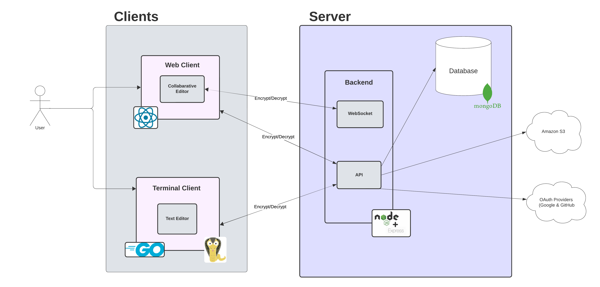
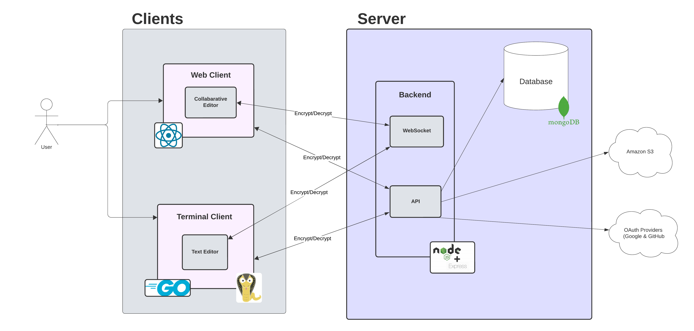
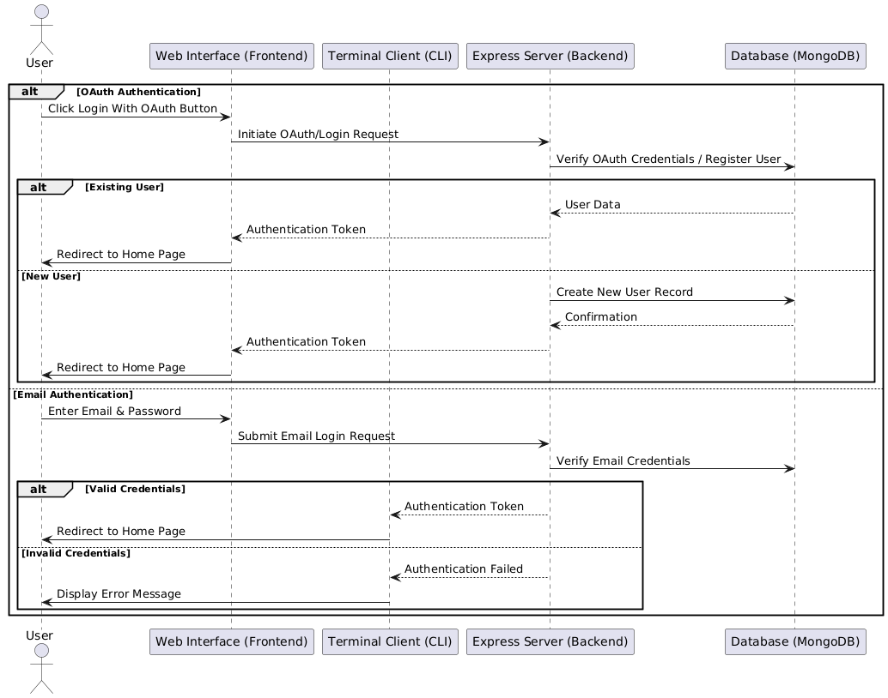
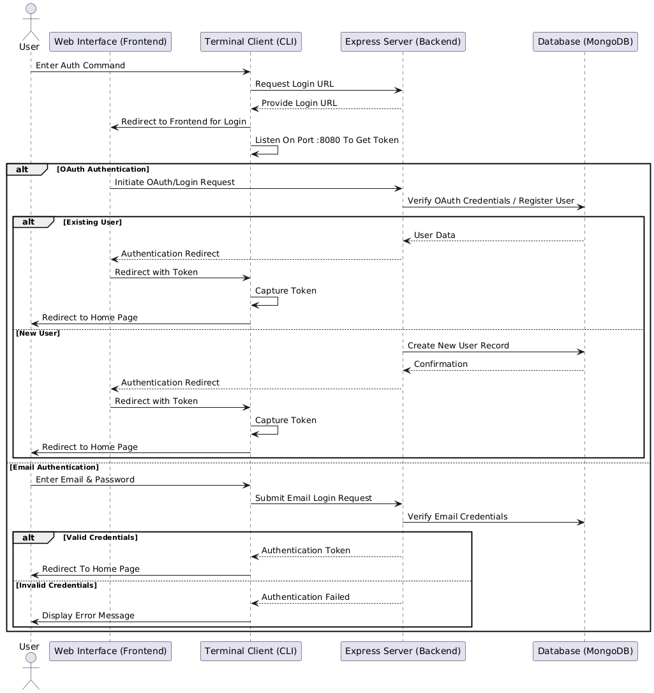
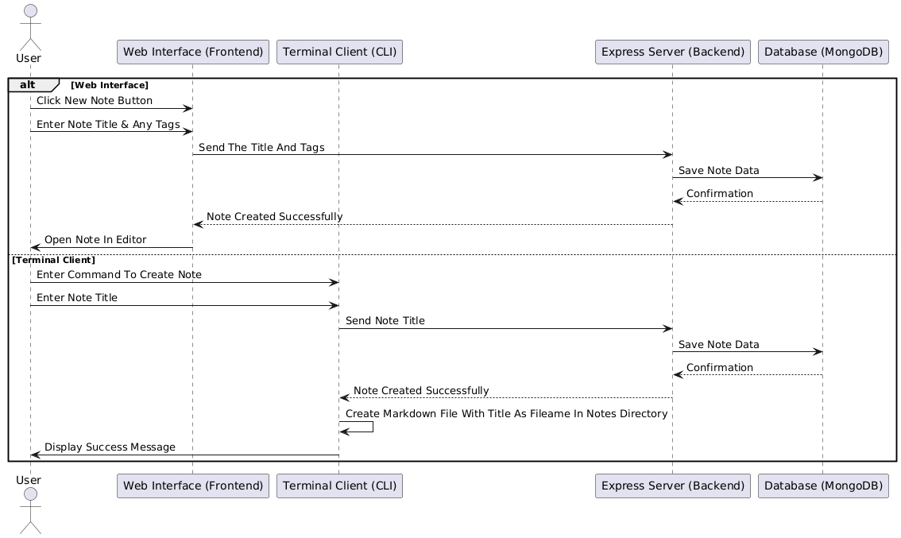
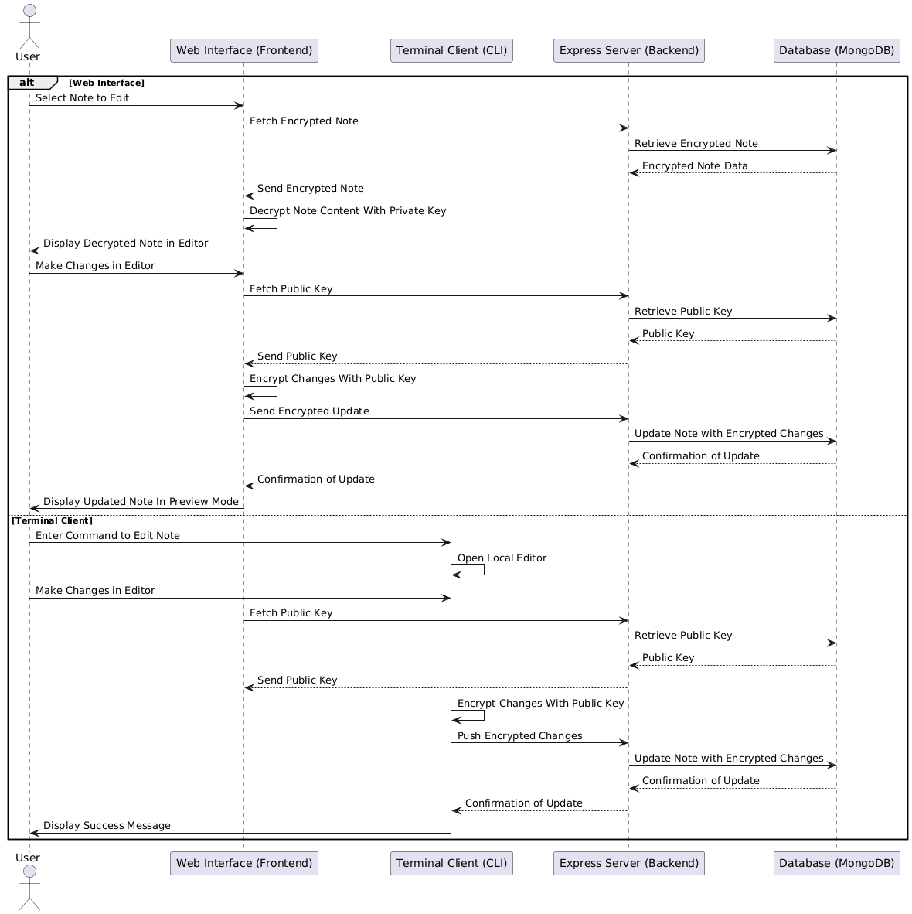
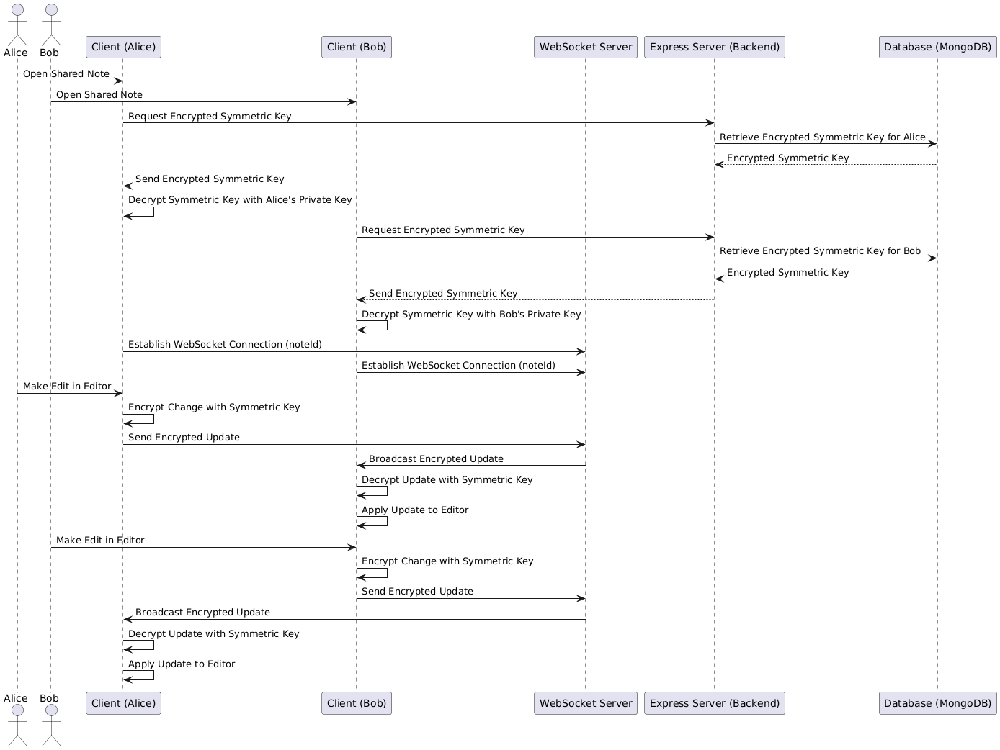
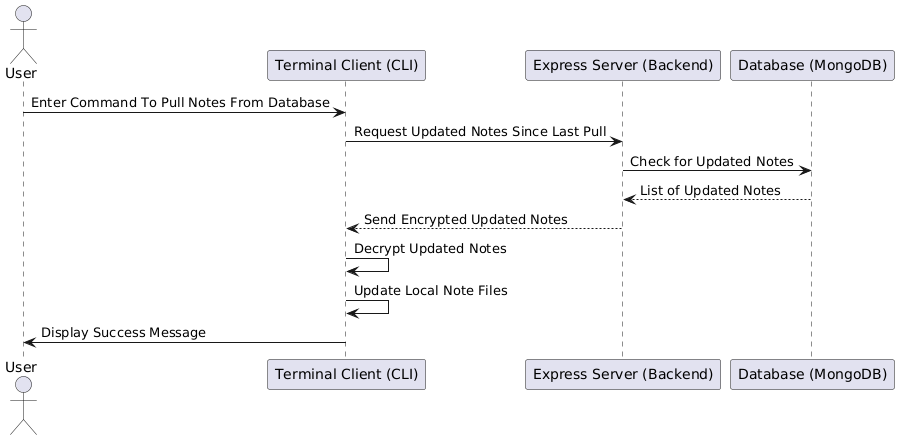
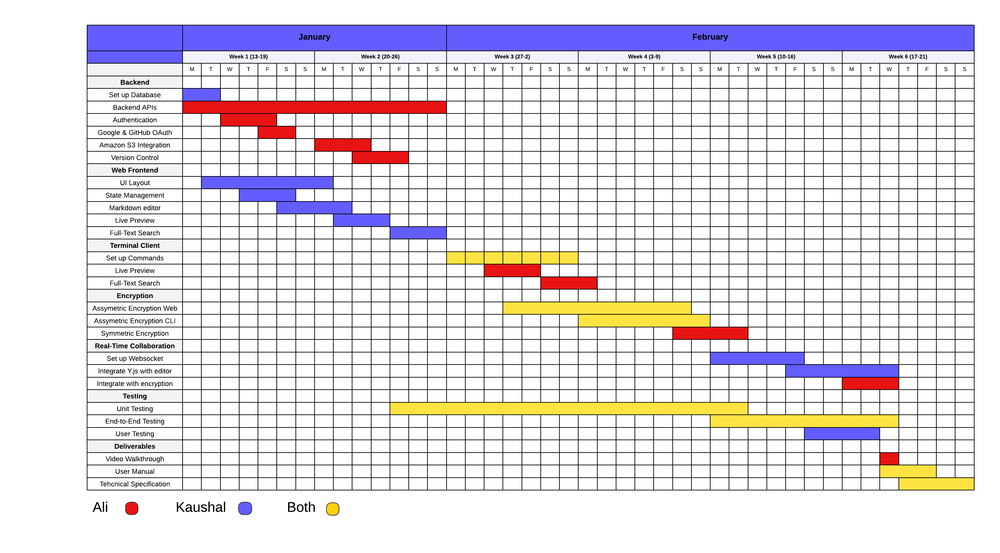

# CSC1049 Functional Spec

# Table of Contents
- [Revision History](#revision-history)
- [1. Introduction](#1-introduction)
  - [1.1 Overview](#11-overview)
  - [1.2 Business Context](#12-business-context)
  - [1.3 Glossary](#13-glossary)
- [2. General Description](#2-general-description)
  - [2.1 Product/System Functions](#21-productsystem-functions)
    - [2.1.1 Primary Functions](#211-primary-functions)
    - [2.1.2 Secondary Functions](#212-secondary-functions)
    - [2.1.3 Stretch Functions/Goals](#213-stretch-functionsgoals)
  - [2.2 User Characteristics and Objectives](#22-user-characteristics-and-objectives)
  - [2.3 Operational Scenarios](#23-operational-scenarios)
  - [2.4 Constraints](#24-constraints)
- [3. Functional Requirements](#3-functional-requirements)
  - [3.1 User Authentication](#31-user-authentication)
  - [3.2 End-to-End Encryption](#32-end-to-end-encryption)
  - [3.3 Real-Time Collaboration](#33-real-time-collaboration)
  - [3.4 Create Notes](#34-create-notes)
  - [3.5 Edit Notes](#35-edit-notes)
  - [3.6 View Notes](#36-view-notes)
  - [3.7 Push Notes](#37-push-notes)
  - [3.8 Pull Notes](#38-pull-notes)
  - [3.9 Managing Different Versions](#39-managing-different-versions)
  - [3.10 Adding a Collaborator](#310-adding-a-collaborator)
  - [3.11 Delete Notes](#311-delete-notes)
  - [3.12 Image Handling with Amazon S3](#312-image-handling-with-amazon-s3)
  - [3.13 Full-Text Search](#313-full-text-search)
  - [3.14 Tag Management](#314-tag-management)
  - [3.15 Download HTML Version of Markdown Notes](#315-download-html-version-of-markdown-notes)
- [4. System Architecture](#4-system-architecture)
  - [4.1 Feasible System Architecture](#41-feasible-system-architecture)
    - [4.1.1 Web Client](#411-web-client)
    - [4.1.2 Terminal Client](#412-terminal-client)
    - [4.1.3 Collaborative Editor](#413-collaborative-editor)
    - [4.1.4 API Layer](#414-api-layer)
    - [4.1.5 Web Socket](#415-websocket)
    - [4.1.6 Database](#416-database)
    - [4.1.7 Version Control](#417-version-control)
  - [4.2 Stretch Goal System Architecture](#42-stretch-goal-system-architecture)
    - [4.2.1 Text Editor](#421-text-editor)
- [5. High Level Design](#5-high-level-design)
  - [5.1 Sequence Diagram](#51-sequence-diagram)
    - [5.1.1 User Login on Web Interface](#511-user-login-on-web-interface)
    - [5.1.2 User Login on CLI](#512-user-login-on-cli)	
    - [5.1.3 Creating a Note](#513-creating-a-note)
    - [5.1.4 Editing a Note on Both Clients - No Real-Time Collaboration](#514-editing-a-note-on-both-clients---no-real-time-collaboration)
    - [5.1.5 Editing a Note on Web with Real-Time Collaboration](#515-editing-a-note-on-web-with-real-time-collaboration)
    - [5.1.6 Pulling Notes on CLI](#516-pulling-notes-on-cli)
- [6. Preliminary Schedule](#6-preliminary-schedule)
- [7. Appendix](#7-appendix)

# 1. Introduction

## 1.1 Overview
The system, Noted, is a Markdown-based note-taking application built for both terminal and web users. The system allows users to create, edit and collaborate on notes through a CLI or a web interface.

Key Features of the system include:
- **End-To-End Encryption**
- **Real-Time Collaboration**
- **Google and GitHub OAuth**
- **Versioning System for Notes**
- **Image uploading through Amazon S3**
- **Full-Text Search**
- **Dynamic Preview of Notes**

The system is designed to meet the need for a unified note-taking experience that works seamlessly across both terminal and web interfaces. Developers often prefer terminal tools for note-taking but lack the convenience of a web interface. Noted bridges this gap, offering a central place for managing notes securely and efficiently. It provides synchronisation between terminal and web clients, enabling real-time collaboration while maintaining secure, encrypted content.

## 1.2 Business Context
This system integrates seamlessly with any development environment that supports Go, which is essential for the CLI. It could be easily deployed in Dublin City University's computer labs to support student developers who work across both terminal and web platforms.

## 1.3 Glossary
| Term                                        | Definition                                                                                                                                           |
|---------------------------------------------|-------------------------------------------------------------------------------------------------------------------------------------------------------|
| **OAuth**                                   | A protocol for authorization that allows users to grant third-party applications access to their resources without sharing login credentials.                    |
| **End-to-End Encryption**                   | A method where data is encrypted before it leaves the sender and can only be decrypted by the recipient, keeping it secure from anyone in between. |
| **Asymmetric Encryption**                   | A method using a pair of keys: a public key for encryption and a private key for decryption. It allows secure communication without sharing private keys. |
| **Symmetric Encryption**                    | A method where the same key is used for both encryption and decryption. It is fast and efficient.|
| **Amazon S3**                               | A cloud storage service by AWS for storing and retrieving large amounts of data, often used for media like images.                                       |
| **JWT (JSON Web Token)**                    | A compact, URL-safe token used for securely transmitting information between parties, commonly used for authentication.                               |
| **CRDTs (Conflict-free Replicated Data Types)** | Data structures designed for distributed systems that allow for concurrent updates without conflicts. |
| **Markdown**                                | A lightweight markup language for formatting text. |
| **CLI**                                     | Command-line interface. |
| **WSL**                                     | Windows Subsystem for Linux. |

# 2. General Description

## 2.1 Product/System Functions
### 2.1.1 Primary Functions
#### **User Authentication**
- Users can log in using Google and GitHub OAuth for secure and convenient access. Additionally, users have the option to register and log in with their email and password, with credentials securely stored in MongoDB. JWTs are implemented to maintain secure sessions across both terminal and web platforms.

#### **Asymmetric End-to-End Encryption**
- All notes are encrypted asymmetrically on the users device before being sent to the database, ensuring data security during transmission and storage. A symmetric key is implemented for real-time collaboration. This symmetric key is encrypted and decrypted using the user's public/private key pairs, providing an additional layer of security.

#### **Real-Time Collaboration**
- The system will allow for notes to be edited simultaneously in web clients. Notes will be managed using CRDTs to ensure seamless real-time synchronisation and avoid any conflicts. Additionally, encrypted symmetric keys are employed to maintain privacy throughout the collaboration process.

#### **Note Creation and Management**
- Users have the ability to create, edit, and delete Markdown notes through either the terminal client or the web interface. Regardless of the preferred environment, the notes will be managed seamlessly.

#### **Markdown Rendering and Preview**
- The system renders Markdown to display well-formatted notes in both terminal and web clients. The web client will display live previews, providing immediate visual feedback. For elements that cannot be rendered in the terminal, the system generates a link to view the full preview within the web client.

#### **Tagging and Organisation**
- Notes can be categorised using tags, making it easy to retrieve and organise them.

#### **Full-Text Search**
- A comprehensive search functionality that allows users to find notes based on their content, tags, or titles, ensuring quick and efficient access to relevant information.

#### **Version Control**
- The system maintains a version history for each note, enabling users to view, compare, and restore previous versions as needed. This feature ensures that users can track changes and revert to earlier states of their notes effortlessly.

#### **Image Integration**
- Users can upload and manage images through Amazon S3 cloud storage. The system generates reusable links, allowing users to embed images directly into their Markdown notes, enhancing the visual appeal and functionality of their content.

### 2.1.2 Secondary Functions
#### **Offline Access**
- The CLI will allow for offline editing of notes. As notes on the CLI are edited locally, they can be saved to the server when connectivity is restored.

#### **Export Notes**
- The system allows users to export notes in HTML.

### 2.1.3 Stretch Functions/Goals
#### **Real Time Collaboration in CLI**
- Real-time collaboration within the CLI, allowing multiple users to edit notes simultaneously.

#### **Task Management**
- Basic task management features, such as to-do lists and task assignments, are integrated within notes. This allows users to organise and track tasks directly within their note-taking environment.

## 2.2 User Characteristics and Objectives
**Primary Users**: Developers, software engineers, and tech enthusiasts who frequently work on a CLI, Markdown, and version control systems like Git. It also includes those who prefer working in a CLI, and those interested in writing documentation in real-time with other developers with the ability to see a live preview.

- These users are expected to be able to use a CLI and must have knowledge in writing using Markdown.

**Secondary Users**: Users who seek a simple, user-friendly interface with features like Markdown previews, real-time collaboration, and secured notes through encryption. Also students who would like to be able to work on notes with others.
- These users should have basic knowledge of Markdown but may or may not be familiar with a CLI or encryption.

**Objectives**
- **Ease of Use**: Users want a tool that is simple to set up and use, regardless of their technical expertise.
- **Cross-Platform Support**: The ability to manage notes from both terminal and web interfaces.
- **Security**: Strong encryption to ensure notes are protected from unauthorized access.
- **Collaboration**: Real-time collaboration features are crucial for users who need to work on notes with others. This should be fast while also maintaining security.

**Wish List**
- Offline Editing for users that do not use CLI.
- Being able to render diagrams using Mermaid.js.
- The option for real-time collaboration on the CLI.

## 2.3 Operational Scenarios
Listed below are the different scenarios users might find themselves in.

### **Scenario 1: User Login**

| Objective | To authenticate users and allow them to login.|
|--------------------|-------------|
| **Description** | Users will be able to login using authentication methods such as Google OAuth, GitHub OAuth or Email and Password credentials in order to access the application|
| **Steps** |
|1.| User accesses the  web interface via a browser and gets redirected to the web interface after running the `noted auth` command on CLI.  
|2.| System prompts for login using Google OAuth, GitHub OAuth, or Email and Password.  
|3.| If using OAuth, user is redirected to the provider for authentication.  
|4.| If using Email and Password, user enters credentials. If user does not have an account, they must register. 
|5.| Upon successful login, user is redirected to the home page.  
|6.| If login fails, user is prompted to retry. |

---

### **Scenario 2: Create a New Note**

| **Objective** | To create a new note for editing  |
|--------------------|-------------|
| **Description** | Users can create new notes, which are saved to the data base and version-controlled. They can track changes over time, and revert to a previous version if necessary.
| **Steps** | 
|1.| User clicks "Create New Note" on the web interface or enters the `noted create-note <title>` command in CLI.  
|2. |User provides a title.  
|3.| System saves the note in the database.
|4.| The note will open in the editor allowing the user to edit it.

---

### **Scenario 3: Edit a Note**

| **Objective** |Enable users to modify the content of an existing note or a note just created. |
|--------------------|-------------|
| **Description** | The user will have the ability to edit notes in the text editor on web or the default of their terminal. Web users will also be able to view a live preview as they edit their note.
| **Steps** |
|1.| User selects the note to edit from the home page or enters the `noted edit-note <title>` command on CLI.
|2. |User writes content in the editor.  
|3.| A live preview will appear for web users while they type (split-screen) while CLI users will have to run a command to see the preview (Scenario 6).

---

### **Scenario 4: Delete a Note**

| **Objective** |Allow users to delete an existing note from their account.|
|--------------------|-------------|
| **Description** | Users have the ability to permanently remove notes from their account. This action includes selecting the desired note and confirming the deletion to prevent accidental loss of data. The system updates the database accordingly and notifies the user upon successful deletion. |
| **Steps** |
| 1.| User selects the note to delete from the home page or through the `noted delete-note <title>` command.  
|2.| User confirms the deletion action.  
|3.| System removes the note and updates the database.  
|4.| User is notified of successful deletion. |

---

### **Scenario 5: View a Note On CLI**

| **Objective** | To allow users to preview the content of a note on the CLI|
|--------------------|-------------|
| **Description** | Users will be able to view how their notes look with a preview available on the terminal. They will also be able too access a link to view a full preview on the web for elements unable to be rendered on the terminal.
| **Steps** | 
|1.| User types the command `noted show-preview <title>` to view the note.
|2.| Content is displayed in the terminal and a link is generated for the user to see a full preview on web.

---

### **Scenario 6: Upload an Image to a Note**

| **Objective** | |Be able to upload images and embed them within their notes. |
|--------------------|-------------|------|
| **Description** | |This functionality allows users to enhance their notes by embedding images. Users can upload images through the web interface or CLI, which are then stored in Amazon S3. The system generates URLs for these images, which can then be added to the note using Markdown .
| **Steps** | 
| Web Workflow
|1.| |User is on edit note page on the web.
|| 1.1.|User selects the add image button
| | 1.2.|User uploads an image. 
|| 1.3.|System uploads the image to Amazon S3 and generates a URL.  
|| 1.4.| URL is automatically inserted at the cursor of the user using correct Markdown syntax.
|| 1.5.| Image is displayed within the note. |
|CLI workflow
|2.|   | User runs the upload image command `noted upload-image <path-to-image` on CLI and passes the path to image as a parameter     |
||  2.1. |  System uploads image to Amazon S3 and generates a URL     |
||  2.2. | User embeds the URL into the note.  |
||  2.3. | User will be able to view the note by previewing it in the web.|

---

### **Scenario 7: Pulling Notes on CLI**

| **Objective**    | Allow users to synchronize and retrieve the latest notes from the server to their local CLI environment. |
|------------------|---------------------------------------------------------------------------------------|
| **Description**  | Users who utilize the CLI interface need to keep their local notes directory up-to-date with the latest changes from the server. This ensures that any updates made from other clients (web or CLI) are reflected locally, maintaining consistency across different platforms. |
| **Steps**        | 
| 1. | The user runs the `noted pull-notes` command to get the latest notes.  |
| 2. | The system sends a request to the backend API to retrieve the latest versions of all notes. |
| 3. | The system receives the encrypted notes and decrypts them using the user's private key. |
| 4. | The system updates the local directory with the latest versions, overwriting outdated files as necessary |
| 5. | The system updates the local directory with the latest versions, overwriting outdated files as necessary. |

---

### **Scenario 8: Reverting to a Previous Version of a Note**

| **Objective** | | Allow users to view and restore previous versions of a note. |
|--------------------|-------------| -------------|
| **Description** | |Users will be able to access earlier versions of their notes to retrieve information, undo changes, or correct mistakes. The version control feature provides a history of changes, enabling users to compare versions and revert to a desired state. |
| **Steps** | 
| **Web Workflow** | 
| 1. | |The user selects the note for which they want to view the version history. |
| |1.1. | The user clicks on the "View Version History" button associated with the note. |
| |1.2. | The system retrieves and displays a list of previous versions with timestamps. |
| |1.3. | The user reviews the list and selects a specific version to inspect.  |
| |1.4. | The system presents the content of the selected version for preview. |
| |1.5. | The user clicks on the "Restore this Version" button.|
| |1.6. | The system prompts the user to confirm the restoration action. |
| |1.7. | Upon confirmation, the system restores the note to the selected version, updates the database, and creates a new version entry reflecting this change. |
| **CLI Workflow** | 
| 2. || The user runs the `noted view-history` command to display the version history of the specified note |
| |2.1. | The system retrieves and lists all previous versions with timestamps and summaries. |
| |2.2. | The user reviews the list and selects the version they wish to revert to. |
| |2.3. | The user runs the `noted view-version <note-id> <version-id>` command to view the contents of that version. |
| |2.4. | The user runs the restore version command `noted restore-version <note-id> <version-id>` to restore the note.|
| |2.5. | The system restores the note to the selected version, updates the database, and creates a new version entry reflecting this change. |

---

### **Scenario 9: Create and Manage Tags for Notes**

| **Objective** | |Be able to categorize notes using tags for better organization and retrieval. |
|--------------------|-------------|------|
| **Description** || Users can create and assign tags to their notes, facilitating easier organization and searchability. Tags help in categorizing notes based on topics, projects, or any other criteria set by the user. Users can also remove or modify tags as needed. |
| **Steps** |
| Web Workflow
|1.| |The user selects the note to which they want to add tags.
|| 1.1.|The user clicks the "Add Tag" button and enters the tags they wish to add.
| | 1.2.|The system updates the note's tags in the database.
|| 1.3.| The user can now filter notes by tags on the homepage.
|CLI workflow
|2.|   | User runs the add tag command `noted add-tag <tag> <title>` and passes the tags to add along with the note.   |
||  2.1. | The system updates the note's tags in the database.|
||  2.2. | User can now search for tags using the search command.  |

---

### **Scenario 10: Search and Filter Notes**

| **Objective** | To allow users to search for notes by keywords and filter them using tags for efficient retrieval. |
|--------------------|-------------|
| **Description** | Users can perform keyword searches and apply tag-based filters to quickly locate specific notes. This functionality enhances the usability of the application by allowing users to manage large volumes of notes effectively. |
| **Steps** |
| 1.| User accesses the search bar on the web interface or runs the `noted search <keyword/title/tag` command in CLI.  
|2. |User enters keywords related to the note's content or title.  
|3.| User selects specific tags to narrow down search results.  
|4.| System processes the query and applies filters.  
|5.| Matching notes are displayed based on search criteria and selected tags. |

---

### **Scenario 11: Adding a Collaborator**

| **Objective** | Be able to invite others to collaborate on  notes. |
|--------------------|-------------|
| **Description** | When editing notes users will be able to invite others to edit with them. Collaborators receive invitations and, upon acceptance, gain access to the shared notes.
| **Steps** |
| 1.| Owner opens the note and clicks "Add Collaborator".  
|2.| Owner enters the collaborator’s email or username.  
|3.| System verifies the collaborator’s credentials.  
|4.| System sends an invitation via email.  
|5.| Collaborator accepts the invitation.
|6.| The two users begin collaborating.

---

### **Scenario 12: Edit a Note with a Collaborator**

| **Objective** | Allow real-time collaborative editing of a shared note between multiple users. |
|--------------------|-------------|
| **Description** | This feature allows multiple users to edit the same note simultaneously. Changes made by collaborators are synchronized in real-time, ensuring consistency and preventing conflicts through the use of Conflict-free Replicated Data Types (CRDTs). |
| **Steps** | 
|1.| Both owner and collaborator open the shared note simultaneously.  
|2.| Each user makes changes to the note’s content in real-time.  
|3.| System synchronizes edits instantly across all active sessions.  
|4. | Both users will be able to see changes made by one another.

---

### **Scenario 13: Removing a Collaborator**

| **Objective** | Allow the owner to remove a collaborator’s access to a shared note. |
|--------------------|-------------|
| **Description** | Owners have the authority to manage collaborators by revoking access when necessary. This ensures that only authorized users can edit or view specific notes, maintaining the privacy and security of the content. |
| **Steps** | 
|1.| Owner selects the shared note from their homepage.  
|2.| Owner clicks "Manage Collaborators".  
|3.| Owner selects the collaborator to remove.  
|4. |Owner confirms the removal.  
|5.| System revokes the collaborator’s access and updates the database accordingly. |

---

### **Scenario 14: Downloading the HTML Version of a Note**

| **Objective** | |Allow users to download their Markdown notes as HTML files. |
|--------------------|-------------|-------------|
| **Description** || Users will be able to export their notes in HTML format for sharing, presenting, or integrating with other applications. This feature enables users to convert their Markdown notes to HTML and download them directly from the application. |
| **Steps**        | 
| **Web Workflow** | 
| 1. || The user opens the note they wish to download. |
| |1.1. | The user clicks on the "Download as HTML" button associated with the note. |
| |1.2. | System converts the Markdown content of the note into HTML format.|
| |1.3. |  User selects the destination folder and confirms the download.|
| |1.4. | The system initiates the download of the HTML file to the user's device. |
| |1.5. | The user selects the destination folder and confirms the download. |
| |1.6. | HTML file is saved on the user's device. |
| **CLI Workflow** | 
| 2.| | The user runs the command `noted pull-html <title> [path]` to download the HTML file of the note passing it the title of the note. |
| |2.1. | System converts the Markdown content of the note into HTML format and downloads it into the users current working directory or to the path of the destination folder if provided.|

## 2.4 Constraints

**Time Constraints**
The main challenge is the short timeframe available for development. A lot of features must be implemented within a short period. Getting proficient in Go and learning new tools might hinder development time.

**Design Constraints**
The design needs to be responsive to various screen sizes, to ensure consistency and a user-friendly experience across devices.

**Platform Constraints**
The CLI will only be available on Unix-based operating systems. It will not be available on Windows unless through WSL. The web interface must perform consistently across multiple browsers. Encryption needs to be implemented properly so notes can be encrypted and decrypted regardless of platform.

**Performance and Speed Requirements**
By implementing encryption and real-time collaboration, performance might be affected. We must deliver real-time updates without noticeable latency to ensure user experience stays smooth.

**Resource Constraints**
MongoDB and Amazon S3 do not provide unlimited storage for free tiers. We must observe our usage to ensure we stay within free tier limits.

# 3. Functional Requirements

## 3.1 User Authentication
- **Description**: The system must allow users to authenticate through Google OAuth, GitHub OAuth, or by creating a local account. For a local account, the user must register before logging in. For OAuth, the system stores the user information in the database during their first authentication. On subsequent logins, the system grants access without additional registration. Once authenticated, the user is granted access. For the CLI, when a user first authenticates, the system will create a directory that will store all the notes that the user creates .
- **Criticality**: High - User authentication serves as the gateway to all functionality in the system.
- **Technical Issues**:
    - Securely handling OAuth integration for Google and GitHub with the backend.
    - Handling user sessions effectively for access.
    - Implementing user account management for local sign-ups, including password hashing and validation.
- **Dependencies with other requirements**:
    - Dependent on the backend setup for managing sessions and OAuth configuration.
    - Foundational for all other requirements that require user verification.

## 3.2 End-to-End Encryption
- **Description**: The system must implement asymmetric end-to-end encryption to protect the security of user notes. Using a pair of cryptographic keys (public and private), notes should be encrypted on the user's device before being stored on the server, ensuring that only the user can access the content with their private key. For collaboration, notes are encrypted using a symmetric key which is encrypted individually using the public key of each collaborator.
- **Criticality**: High - Ensures that the user's notes remain confidential and secure, addressing privacy concerns and protecting against unauthorised access.
- **Technical Issues**:
    - Generating and managing asymmetric key pairs (public and private keys) for each user effectively.
    - Handling key distribution and encryption for collaborative access using shared symmetric keys.
    - Integrating encryption properly on both web interface and CLI, so encryption and decryption are seamless across both platforms.
- **Dependencies with Other Requirements**:
    - Links with **Managing Different Versions** (3.9) as they store encrypted versions of the note.
    - Ties into **Real-Time Collaboration** (3.3) for ensuring data is secure when being sent between clients.
    - Integrates with **Edit Notes** (3.5), **Push Notes** (3.7), **Pull Notes** (3.8)
    - Depends on web and CLI clients being capable of performing encryption/decryption locally.

## 3.3 Real-Time Collaboration
- **Description**: The system must support real-time collaboration, allowing multiple users to work on the same note simultaneously. Changes made by one user should be reflected for all collaborators. Notes should be securely encrypted during collaboration.
- **Criticality**: High - Essential for teams that need to collaborate on notes.
- **Technical Issues**:
    - Implementing real-time synchronisation using Y.js to handle concurrent edits.
    - Ensuring only users that have been given access can edit it.
    - Ensuring encryption doesn't delay transmission of data between clients.
    - Making sure conflicts are resolved correctly.
- **Dependencies with Other Requirements**:
    - Relies on real-time WebSocket communication for real-time transmission.
    - Depends on **End-to-End Encryption** (3.2) for encrypted collaboration.
    - Relies on **Managing Different Versions** (3.9) for storing versions.
    - Depends on **Managing Collaborators** (3.10).
    - Integrates with **Edit Notes** (3.5).

## 3.4 Create Notes
- **Description**: The user must be able to create new Markdown notes through the web interface and CLI. On the CLI, a Markdown file with the name of the title of the note will be created in the directory that holds all notes.
- **Criticality**: High - This is a core feature of the application. Without the ability to create notes, users wouldn't be able to utilise the other features that depend on notes.
- **Technical Issues**:
    - Creating a note on CLI with a command must properly store it in the database, ensuring its accessibility on both clients.
    - Ensuring that the directory that stores all notes has not been deleted.
- **Dependencies with other requirements**:
    - Relies on **Managing Different Versions** (3.9).

## 3.5 Edit Notes
- **Description**: Users must be able to edit existing notes. Users should be able to modify the content of their notes, with changes being encrypted and saved in the database with proper version tracking. Users on the web interface must also have the choice to see a live preview of the content rendered in Markdown. Users should be able to see the cursor of another user during collaboration and the changes that they have made. On the CLI, this will open the note in the default editor of the terminal.
- **Criticality**: High - Editing notes is essential for users. Without this feature, users would be unable to make any changes to their notes after creation.
- **Technical Issues**:
    - Ensuring the note on the CLI has not been deleted from the main directory; the system will have to grab the latest version in the database if this is the case.
    - Managing and storing edited notes with proper version control.
    - Ensuring Markdown content is rendered correctly on both platforms.
    - Ensuring content is synchronised during real-time collaboration.
    - Showing changes made by different users and indicating where they are in the editor.
- **Dependencies with other requirements**:
    - Depends on **End-to-End Encryption** (3.2) for encrypting content.
    - Relies on **Managing Different Versions** (3.9) to keep track of changes made to notes and allow for version restoration.
    - Integrates with **Real-Time Collaboration** (3.3) and Image Handling with Amazon S3 (3.12).
    - Relies on **View Notes** (3.6) to show the user a live preview.

## 3.6 View Notes
- **Description**: Users must be able to view their notes, rendered in Markdown format. Users must be able to view any note they have created, and the notes should be accessible from both the web and CLI. In the web interface, users must have the option to view notes as they write them. The system should display a preview of the notes directly in the terminal and provide a link to the web interface to show a full preview for elements that cannot be rendered in the terminal.
- **Criticality**: High - Fundamental for users to review their notes and ensure it is formatted correctly.
- **Technical Issues**:
    - Correctly rendering content on web interface and CLI.
    - Fast reading of the note file on the CLI to render in the terminal.
- **Dependencies with other requirements**:
    - Ties into **Edit Notes** (3.5) to show users a live preview.

## 3.7 Push Notes
- **Description**: The system must allow the CLI client to push local changes to the server. This is to ensure edits made on the terminal are sent to the database so the two clients will be kept in sync. The content of the note must be encrypted before being sent to the server.
- **Criticality**: High - Essential as it is the way CLI users will send the note they have written to the server.
- **Technical Issues**:
    - Main issue is to quickly read the file content to push to the server.
- **Dependencies with other requirements**:
    - Dependent on **End-to-End Encryption** (3.2) for encrypting the content before being sent to the server.
    - Relies on **Managing Different Versions** (3.9) to keep track of changes made to notes and allow for version restoration.

## 3.8 Pull Notes
- **Description**: The system must allow the CLI client to pull the notes from the server into the directory created for notes. All notes must be decrypted as well before being stored.
- Users must be able to delete their notes. The system should confirm successful deletion and ensure all associated data are removed as well.
- **Criticality**: High - Critical for users as it ensures they have access to the most recent updates made from any client.
- Not critical to the main functionality of the system, allows users to have full control over their notes, allowing them to remove unnecessary notes.
- **Technical Issues**:
    - Decrypting each note will take time, especially if there are a lot of notes. A proper system should be developed to ensure notes that have been edited since the last pull will be retrieved from the database.
- **Dependencies with other requirements**:
    - Dependent on **End-to-End Encryption** (3.2) for decrypting content.
    - The backend and CLI's abilities to quickly retrieve and store files from the database.

## 3.9 Managing Different Versions
- **Description**: The system must provide a built-in versioning system for notes, enabling users to view and restore previous versions of a note. Notes are encrypted until the user wishes to view the content, at which point it is decrypted.
- **Criticality**: High - Version control is important for users who need to track changes, undo mistakes, or restore previous work.
- **Technical Issues**:
    - Main issue is to store multiple versions of notes in MongoDB efficiently, ensuring retrieval is fast and handling rollback to previous versions in a user-friendly manner.
    - Only the version the user wants to see will be decrypted, saving time as not all versions are required to be decrypted.
- **Dependencies with other requirements**:
    - Used in **Edit Notes** (3.5) and **Push Notes** (3.7).
    - The backends ability to manage and store data.

## 3.10 Managing Collaborators
- **Description**: Users must be able to manage collaborators, giving them access to view and edit shared notes and remove access when necessary.
- **Criticality**: High - Essential feature for collaboration.
- **Technical Issues**:
    - Must ensure the symmetric key for collaboration is encrypted with the collaborator's public key.
- **Dependencies with other requirements**:
    - Ties into **Real-Time Collaboration** (3.3).

## 3.11 Delete Notes
- **Description**: Users must be able to delete their notes. The system should confirm successful deletion and ensure all associated data are removed as well.
- **Criticality**: Medium - Not critical to the main functionality of the system, allows users to have full control over their notes, allowing them to remove unnecessary notes.
- **Technical Issues**:
    - Ensure everything associated with the note is deleted.
- **Dependencies with other requirements**:
    - N/A

## 3.12 Image Handling with Amazon S3
- **Description**: The system must allow users to upload and link images from Amazon S3 to their notes. This reduces storage requirements and improves performance. Users on the web interface do not have to add the link of the image themselves; this will be handled by the system.
- **Criticality**: Medium - This feature improves the user experience by allowing image embedding but is not essential to the core functionality of note creation.
- **Technical Issues**:
    - Integration of Amazon S3 with backend.
    - Reading images on the CLI and web interface so they have the correct format that is required to upload them to S3.
    - Limitations on file sizes.
- **Dependencies with other requirements**:
    - Integrates with **Edit Notes** (3.5) for embedding images within notes.

## 3.13 Full-Text Search
- **Description**: Users must be able to search for notes by title, content, or tags. The search feature should quickly return relevant results to facilitate easy navigation through large sets of notes.
- **Criticality**: Medium/ Low - A feature for usability, but the system can function without it.
- **Technical Issues**:
    - As notes are encrypted, searching must be done on the client. An efficient search indexing system must be implemented to quickly search the files.
- **Dependencies with other requirements**:
    - Utilises tag data from **Tag Management** (3.14) for searching.

## 3.14 Tag Management
- **Description**: Users must be able to tag their notes with labels for categorisation and easy searching. They must also be able to remove any tags as well.
- **Criticality**: Medium - Helps in organising notes but is not critical for basic functionality.
- **Technical Issues**: N/A
- **Dependencies with other requirements**:
    - Used by **Full-Text Search** (3.13).

## 3.15 Download HTML Version of Markdown Notes
- **Description**: Users must be able to download their Markdown notes as HTML files.
- **Criticality**: Low - Adds convenience for users, not essential at all.
- **Technical Issues**:
    - Must ensure the note is saved correctly in the CLI - to the current directory or a specified one if provided.
- **Dependencies with other requirements**: N/A

# 4. System Architecture

## 4.1 Feasible System Architecture

*Figure 1: High-Level System Architecture*

### 4.1.1 Web Client
The web client is one of the two ways for users to interact with our platform and it will be developed using React, Vite, JavaScript and Redux for state management. Users can create, edit and collab with other users.
The web client interacts with the backend API where it will send and receive encrypted notes. It also connects to the WebSocket to handle real-time collaboration. Additional features include live Markdown previews, image handling with Amazon S3, full-text search and tag management.

### 4.1.2 Terminal Client
This is the Go-based CLI interface built using the Cobra framework where users can create, edit, and manage their Markdown notes [1]. It performs functions such as creating new notes, editing existing ones using terminal editors, pushing changes to the server, and pulling updates to keep notes synchronized.  It handles encryption and decryption locally to ensure security. It interacts with the API for communication with the backend and with the local file system for storing notes.

### 4.1.3 Collaborative Editor
The collaborative editor is responsible for real-time collaboration. It utilises Y.js and CRDTs to resolve conflicts during simultaneous edits. It communicates with the WebSocket to synchronise changes across different clients. This is integrated within the web client.

### 4.1.4 API Layer
The API layer acts as a communication interface between the clients and the backend server. It provides endpoints for operations such as user authentication, note management, tagging and version control. It interacts directly with the database to perform necessary operations with the users' notes.

### 4.1.5 WebSocket
The WebSocket establishes connections to maintain real-time synchronisation across web clients. It interacts with the collaborative editor to broadcast messages based on the note being edited. Data sent between the editor and the websocket is encrypted on the client side.

### 4.1.6 Database
The database will store user notes and any associated data with it, their version along with user information and collaboration permissions. It interacts with the API for data retrieval and storage. 

## 4.2 Stretch Goal System Architecture

*Figure 2: Stretch Goal System Architecture*

### 4.2.1 Text Editor
Handles real-time collaboration. Communicates with the WebSocket and ensures changes are synchronised across different clients (web and CLI).

# 5. High-Level Design

### 5.1 Sequence Diagram

### 5.1.1 User Login on Web Interface 

*Figure 3: User Web Login Sequence Diagram*

## 5.1.2 User Login on CLI

*Figure 4: User CLI Login Sequence Diagram*

## 5.1.3 Creating a Note

*Figure 5: Create Note Sequence Diagram*

## 5.1.4 Editing a Note on Both Clients - No Real-Time Collaboration

*Figure 6: Edit Note Sequence Diagram*

## 5.1.5 Editing a Note on Web with Real-Time Collaboration

*Figure 7: Real-Time Edit Sequence Diagram*

## 5.1.6 Pulling Notes on CLI

*Figure 8: Pull Notes Sequence Diagram*

<!-- ## 5.1 Web application overview

## 5.2 CLI overviewz
 -->

# 6. Preliminary Schedule

## 6.1 Project Plan

We broke down the project into small section, dividing the work equally among ourselves in order to use our time on this project efficiently.
We have chosen to work on some tasks together in order to avoid the scenario where one of us will need support to complete a specific task. This ensures that if one of us needs support, the other won’t be too caught up with their own tasks to help. This schedule is flexible and may change as we make progress and better understand the remaining work.

| Major Task                  | Subtask                        | Assigned To  | Start Date | End Date   |
|-----------------------------|--------------------------------|--------------|------------|------------|
| Backend                    | Set up Database               | Kaushal      | Jan 13     | Jan 14  |
| Backend                    | Backend APIs                  | Ali          | Jan 13     | Jan 26     |
| Backend                    | Authentication                | Ali          | Jan 15     | Jan 17     |
| Backend                    | Google & GitHub OAuth         | Ali          | Jan 17     | Jan 18     |
| Backend                    | Amazon S3 Integration         | Ali          | Jan 20     | Jan 22      |
| Backend                    | Version Control               | Ali          | Jan 22     | Jan 24     |
|  Frontend               | UI Layout                     | Kaushal      | Jan 14     | Jan 20     |
|  Frontend               | State Management              | Kaushal      | Jan 16     | Jan 18     |
|  Frontend               | Markdown Editor               | Kaushal      | Jan 18     | Jan 21      |
|  Frontend               | Live Preview                  | Kaushal      | Jan 21     | Jan 23      |
|  Frontend               | Full-Text Search              | Kaushal      | Jan 24      | Jan 26     |
| Terminal Client            | Set up Commands               | Both         | Jan 27     | Feb 2     |
| Terminal Client            | Live Preview                  | Ali         | Jan 29     | Jan 31      |
| Terminal Client            | Full-Text Search              | Ali          | Feb 1      | Feb 3      |
| Encryption                 | Asymmetric Encryption (Web)   | Both          | Jan 30     | Feb 8      |
| Encryption                 | Asymmetric Encryption (CLI)   | Both          | Feb 3      | Feb 9      |
| Encryption                 | Symmetric Encryption          | Ali         | Feb 8     | Feb 11     |
| Real-Time Collaboration    | Set up WebSocket              | Kaushal         | Feb 10     | Feb 14     |
| Real-Time Collaboration    | Integrate Y.js with Editor    | Kaushal      | Feb 14     | Feb 19     |
| Real-Time Collaboration    | Integrate with Encryption     | Ali         | Feb 17     | Feb 19     |
| Testing                    | Unit Testing                  | Both         | Jan 24    | Feb 11     |
| Testing                    | End-to-End Testing            | Both         | Feb 10     | Feb 19     |
| Testing                    | User Testing                  | Kaushal         | Feb 15     | Feb 18     |
| Deliverables               | Video Walkthrough             | Ali          | Feb 19     | Feb 19     |
| Deliverables               | User Manual                   | Both      | Feb 19     | Feb 21     |
| Deliverables               | Technical Specification       | Both         | Feb 20     | Feb 23     |

## 6.2 GANTT Chart

## 6.3 Resource Requirements

**Hardware**
- PC/Laptop for each project partner that can run Linux or WSL through Windows.

**Software**
- Visual Studio Code, Firefox, Google Chrome, MongoDB, Postman for testing APIs.

**Wetware**
- Experience in Javascript, Golang, Cobra, Express, Node.js, TailwindCSS

# 7. Appendix
*[1] “Cobra.dev,” Cobra.Dev, https://cobra.dev/ (accessed Nov. 1, 2024).* 

