# Noted Technical Manual

Student 1: **Ali Ahmad** - 22312403

Student 2: **Kaushal Sambhe** - 22388443


Supervisor: **Dr. Stephen Blott**

# Table of Contents
 - [1. Introduction](#1-introduction)
   - [1.1 Overview/Motivation](#11-overviewmotivation)
   - [1.2 Glossary](#12-glossary)
 - [2. System Architecture](#2-system-architecture)
 - [3. High Level Design](#3-high-level-design)
    - [3.1 Class Diagram](#31-class-diagram)
    - [3.2 Sequence Diagrams](#32-sequence-diagrams)
      - [3.2.1 Unlock Notes (Web)](#321-unlock-notes-web)
      - [3.2.2 Create Master Password](#322-create-master-password)
      - [3.2.3 Sign In Web](#323-sign-in-web)
      - [3.2.4 Sign Up Web](#324-sign-up-web)
      - [3.2.5 OAuth Flow](#325-oauth-flow)
      - [3.2.6 CLI Unlock](#326-cli-unlock)
      - [3.2.7 CLI Login](#327-cli-login)
      - [3.2.8 CLI Sync](#328-cli-sync)
      - [3.2.9 Create Note](#329-create-note)
      - [3.2.10 Edit Note](#3210-edit-note)
      - [3.2.11 Web Restore Note](#3211-web-restore-note)
      - [3.2.12 CLI Restore Note](#3212-cli-restore-note)
 - [4. Problems and Resolutions](#4-problems-and-resolutions)
    - [4.1 Choosing the right encryption approach](#41-choosing-the-right-encryption-approach)
    - [4.2 Key Storage](#42-key-storage)
        - [4.2.1 CLI Key Storage](#421-cli-key-storage)
        - [4.2.2 Web Key Storage](#422-web-key-storage)
    - [4.3 Version Control](#43-version-control)
    - [4.4 Cross-Language Diff implementation and Delta Compression](#44-cross-language-diff-implementation-and-delta-compression)
    - [4.5 Syncing Notes on CLI](#45-syncing-notes-on-cli)
    - [4.6 Edit Note Modal closing on error](#46-edit-note-modal-closing-on-error)
    - [4.7 Editor Performance issues](#47-editor-performance-issues)
    - [4.8 CLI login](#48-cli-login)
    - [4.9 Learning new things](#49-learning-new-things)
    - [4.10 Gitlab CI/CD Issues](#410-gitlab-cicd-issues)
    - [4.11 Testing Issues](#411-testing-issues)
 - [5. Development Workflow](#5-development-workflow)
 - [6. Testing](#6-testing)
    - [6.1 GitLab CI/CD](#61-gitlab-cicd)
        - [6.1.1 Git Usage](#611-git-usage)
    - [6.2 Unit/Integration testing](#62-unitintegration-testing)
        - [6.2.1 Frontend](#621-frontend)
        - [6.2.2 Backend](#622-backend)
        - [6.2.3 CLI](#623-cli)
    - [6.3 End-to-End testing](#63-end-to-end-testing)
    - [6.4 User testing](#64-user-testing)
 - [7. Installation](#7-installation)
    - [7.1 Prerequisites](#71-prerequisites)
    - [7.2 Backend Installation](#72-backend-installation)
    - [7.3 Frontend Installation](#73-frontend-installation)
    - [7.4 CLI Installation](#74-cli-installation)

# 1. Introduction

## 1.1 Overview/Motivation

Noted is a secure Markdown-based note-taking application built for both the terminal and the web. It is designed to be a simple and easy-to-use note-taking application that is accessible to everyone. A user can easily create, edit, and manage versions of their notes in a secure and easy-to-use manner regardless of platform. User notes are encrypted with a key derived from their master password.
Noted operates with zero-knowledge encryption,  meaning that Noted has zero knowledge of, or way to retrieve or reset the user's master password.

Key features:
- End-to-End Encryption
- Versioning system for notes
- Authentication via Google or GitHub OAuth
- Image uploading through AWS S3
- Live preview of notes
- Advanced filtering and sorting of notes

Noted’s web interface is built with React and uses a Node.js/Express backend. There’s also a CLI written in Go using the Cobra framework, allowing you to write and sync notes directly in your terminal, with changes reflected on the web. For those who prefer a browser-based editor, Noted integrates CodeMirror for a smooth Markdown editing experience—complete with live previews. Noted can also include images, which are uploaded securely to AWS S3.

Developers  often prefer terminal tools for note-taking but lack a secure, unified solution that syncs  with a web interface while maintaining security and version control. Noted bridges this gap, providing a developer-friendly experience with encryption, versioning, and cross-platform support.


## 1.2 Glossary

| Term | Definition |
|------|------------|
| OAuth | A protocol for authorization that allows users to grant limited access to their resources on one site to another site, without having to expose their credentials. |
| JWT | A JSON Web Token is a standard for securely transmitting data as a JSON object. |
| MongoDB | A NoSQL database that stores data in JSON-like documents. |
| Express | A web application framework for Node.js. |
| React | A JavaScript library for building user interfaces. |
| Vite | A build tool and development server that enables fast and efficient web development, often used in conjunction with React. |
| Tailwind CSS | A  CSS framework for rapidly building custom designs. |
| Flowbite | A library of components for React that goes along with Tailwind CSS. |
| Playwright |  A JavaScript end-to-end testing framework that allows you to write and execute tests
in a browser-like environment, simulating user interactions and verifying the behaviour of your
application. |
| Vitest | A testing framework for JavaScript used for testing React applications, providing capabilities for testing components. |
| Cobra | A library for building powerful command-line applications in Go. |
| AWS S3 | A cloud storage service by AWS for storing and retrieving large amounts of data, often used for media like images. |
| End-to-End Encryption | A security method ensuring data is encrypted on the sender's device and only decrypted on the recipient's device, preventing third parties from accessing it during transmission. |
| Symmetric Encryption | A type of encryption where the same key is used for both encryption and decryption. |
| Asymmetric Encryption | A type of encryption where a public key is used for encryption and a private key is used for decryption. |
| Hybrid Encryption | A type of encryption where a symmetric key is used to encrypt the data and a public key is used to encrypt the symmetric key. |
| Argon2id | A password hashing algorithm that is resistant to GPU attacks. |
| HKDF | A key derivation function that uses a hash function to derive a key from a secret value. |
| AES-GCM | A symmetric encryption algorithm that uses a block cipher to encrypt and authenticate data. |
| Initialization Vector (IV) | A random value used to ensure that the same plain text block does not produce the same cipher text block. |
| Salt | A random value used to ensure that the same password does not produce the same hash value. |
| CodeMirror | A versatile text editor component that can be easily integrated into web applications. |


# 2. System Architecture

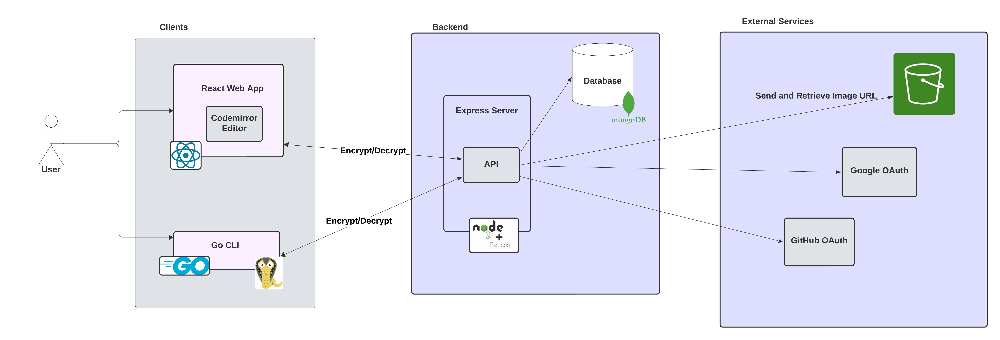

The system follows a multi-tier architecture that divides responsibilities that divides responsibilities among a React-based web app, a Go-based command-line interface (CLI), and an Express server connected to a MongoDB database. External services such as AWS S3, Google OAuth and GitHub OAuth also form integral parts of this design. 

## 2.1 React Frontend Application

Responsible for the web based user interface display of the project, React Web App allows users to interact and access the services of Noted. Given the client-server architecture model design of Noted, the React Web App component servers an important role within our project, acting as one of the primary interfaces between the user and the system. Tailwind CSS and Flowbite are used for styling the application. The web app relies on Redux for managing global state of the application. By maintaining a central store, Redux allows different components of the application to share and update the same state. This is also very useful for storing the user's session data, making it easily accessible across the application and also allows us to check whether a user is logged in or not. For editing notes the system integrates with CodeMirror, a powerful  browser-based editor that supports syntax highlighting and a rich-text editing experience. We chose CodeMirror due to its customisability. To ensure data security, client-side encryption is used to encrypt the note content before it is sent to the server, so the server only receives the encrypted content. The web app also provides multiple authentication methods, including standard email/password login and OAuth via Google or GitHub handled by the backend.

## 2.2 Go CLI

The Go CLI is a command-line interface that allows users to interact with the system. It is built using the Cobra framework and is responsible for managing the user's notes and interacting with the backend server. Users can write and edit notes in their default text editor before sending the changes to the server. The CLI's design mirrors the the core features of the web app, ensuring that all note-related actions remain consistent across both platforms.

## 2.3 Express Server

A Node.js and Express server power the backend of the application. It is responsible for handling requests from both the web app and the CLI, interfacing with MongoDB for data storage. The backend is largely stateless with respect to note content, as actual encryption and decryption occur client side. It does, however, manage user records, note metadata, version tracking and image uploads. Whenever a user uploads an image, the server transfers it to AWS S3, storing nothing and returning a URL to the image. The backend server also handles user authentication, supporting both email/password login and OAuth via Google or GitHub. Allowing account creation and sign-in through familiar social login methods. JWT tokens are used for handling session and access token states for user authentication. Cookies are used to store the JWT token for the frontend, while the actual JWT token is sent to the CLI. Since encryption is handled on the client side, the server itself remains “zero knowledge,” with no way to read user notes or reset their master passwords. 


## 2.4 MongoDB Database

Serving as the system database, the MongoDB database stores all relevant information for the system. The operation of the database is key to facilitating the passage of data throughout the system. 

## 2.5 External Services

Alongside AWS S3 for image storage, the system integrates with Google OAuth and Github OAuth to handle user authentication. Upon user request, the backend redirects to the appropriate OAuth provider, handles the returned tokens and creates user accounts as needed. This mechanism simplifies the onboarding for those who don't want to store their credentials on the server.


## 2.6 Encryption & Versioning

To enforce zero-knowledge encryption model, each note is encrypted on the client using a symmetric key derives from the user's master password. Great effort was out into ensuring that the CLI and the web app were both able to handle the encryption and decryption process allowing for a seamless experience across the system. The CLI leverages the `go-diff` library for generating diffs for versioning, while the web app uses Google's `diff-match-patch` library. The `go-diff` library was chosen due to it being a port of the `diff-match-patch` library. These diffs are then encrypted and sent to the server, minimizing both data transfer size and exposure of sensitive content. Periodic snapshots ensure that reconstructing an older version does not require traversing an excessive chain of diffs. By splitting version data into snapshots and diffs, the system provides efficient rollbacks and a compact version history for each note.


# 3. High Level Design

## 3.1 Class Diagram

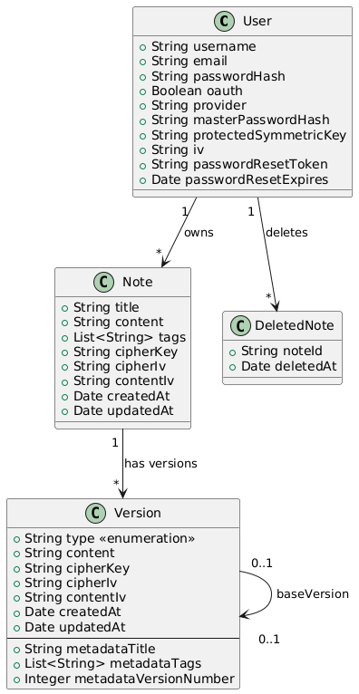

The User collection is the foundation of the application. It holds essential attributes such as email and password hash that deal with authentication. Additional fields related to client-side encryption are also stored here (masterPasswordHash, protectedSymmetricKey & iv). These attributes cover tasks like registration, login and password reset but also support our zero-knowledge encryption paradigm by storing cryptographic metadata securely.


The Note collection represents the primary content entity. each note is created by a User and stores details such as title, content and tags. In addition, it includes encryption-specific properties like cipherKey, cipherIV and contentIv, which are used to securely encrypt the note's content. 

The DeletedNote collection is used to manage notes that have been deleted so the CLI can properly sync notes. When a note is deleted, its identifier (noteId) and deletion timestamp (deletedAt) are stored in the collection. This ensures that deletions are properly tracked and synced across different devices.

To Version collection deals with the version history of a note.  Instead of storing a full copy of the note for every change, we only store the changes (diffs) between each version, with periodic snapshots (full copies) to facilitate efficient version reconstruction. Each version has a type of either "snapshot" or "diff" and also stores metadata of the note (title and tags). Encryption fields are also included to ensure that the version history is encrypted and secure.

## 3.2 Sequence Diagrams

### 3.2.1 Unlock Notes (Web)


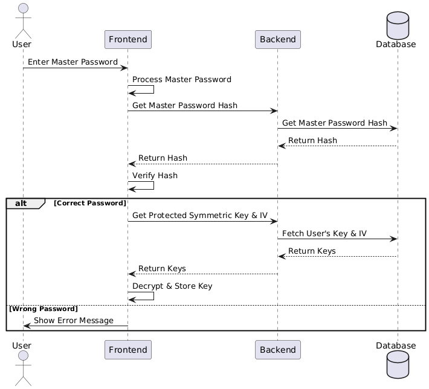

This diagram shows what happens when a user unlocks their notes on the web application. When the user enters their master password, the frontend locally computes the necessary cryptographic data and hashes. A request to the backend is sent to retrieve the stored master password hash. Once received, the frontend computes the a local master password hash and compares it with the stored hash. If they match, the frontend requests and, once received decrypts the symmetric key and stores it in memory. More information about the cryptographic operations can be found [here](https://ali-thepro.github.io/third-year-blog/posts/feb-11-2025/).

---

### 3.2.2 Create Master Password

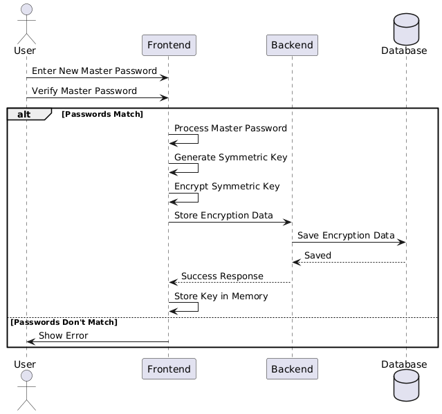

When setting up a master password after signing up, the user enters and confirms their master password. This processes the frontend to locally compute the necessary cryptographic data and hashes. A request is sent to the backend to store the master password hash, symmetric key and iv in the database.

---

### 3.2.3 Sign In Web

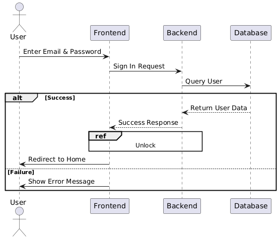

This diagram shows the process for singing in using an email and password. The user enters their email and password and the frontend sends these credentials to the backend. The backend queries the database for the user. If the credentials are valid, the backend sends a success response along with an JWT token, stored in a cookie to the frontend. The frontend redirects the user to the home page, and the unlock sequence to retrieve and decrypt the symmetric key is triggered. 

---

### 3.2.4 Sign Up Web

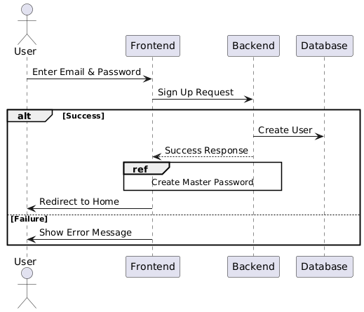

When signing up, the user enters their email and password on the sign up page. The frontend sends a registration request to the backend. The backend checks the database to ensure the user doesn't already exist. If the user is new, the backend creates a new user and returns a success response. The frontend then proceeds to prompt the user to create their master password, following the process described earlier, and finally redirects the user to the home page. 

---

### 3.2.5 OAuth Flow

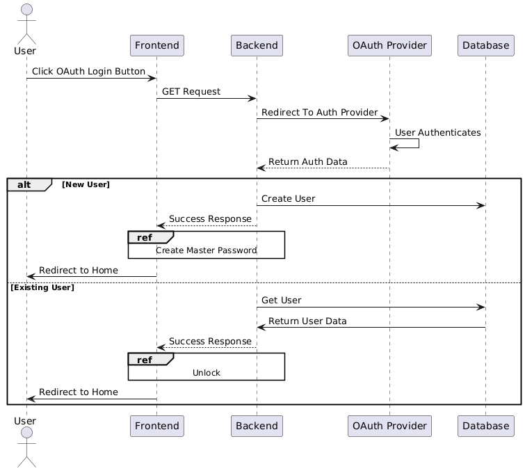

This diagram illustrates how the system handles OAuth logins using Google and GitHub. When a user clicks on the "Login with OAuth" button, the frontend sends a GET request to the backend, which then redirects the user to the appropriate OAuth provider's login page. After the user logs in and grants access, the provider redirects the user back to the application, carrying  authentication data to the backend. The backend checks if the user already exists; if not, a new user is created. The backend then sends a success response with a JWT token, stored in a cookie to the frontend. Depending on whether the user is new or returning. the frontend either initiates the master password creation process or triggers the unlock sequence.

---

### 3.2.6 CLI Unlock

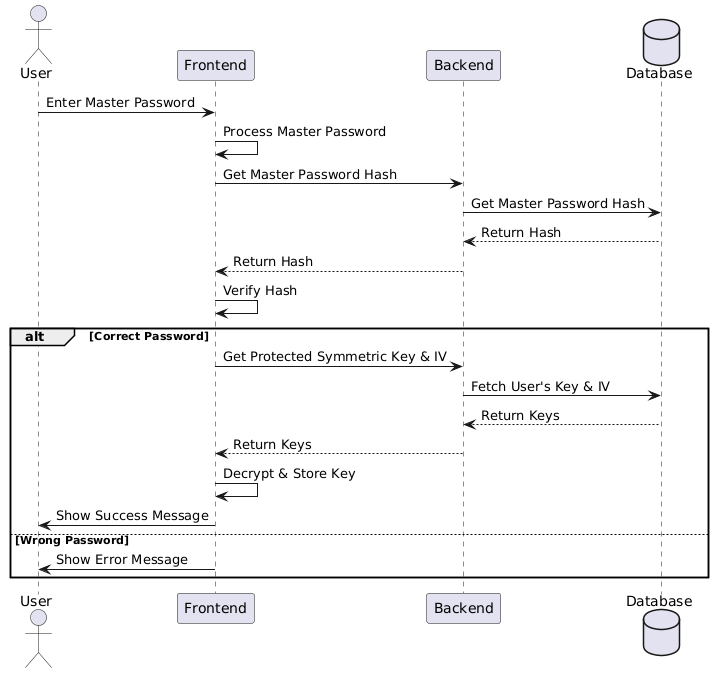

This diagram outlines the process for unlocking notes on the CLI. The user enters their master password into the CLI, which processes it locally by generating the necessary keys and hashes. The CLI then communicates with the backend to retrieve the stored master password hash from the database. After receiving the hash, the CLI compares it  with the locally computed value. If the comparison is successful, the CLI requests the symmetric key and iv from the backend. Once received, the CLI decrypts the symmetric key and stores it in memory.

---

### 3.2.7 CLI Login

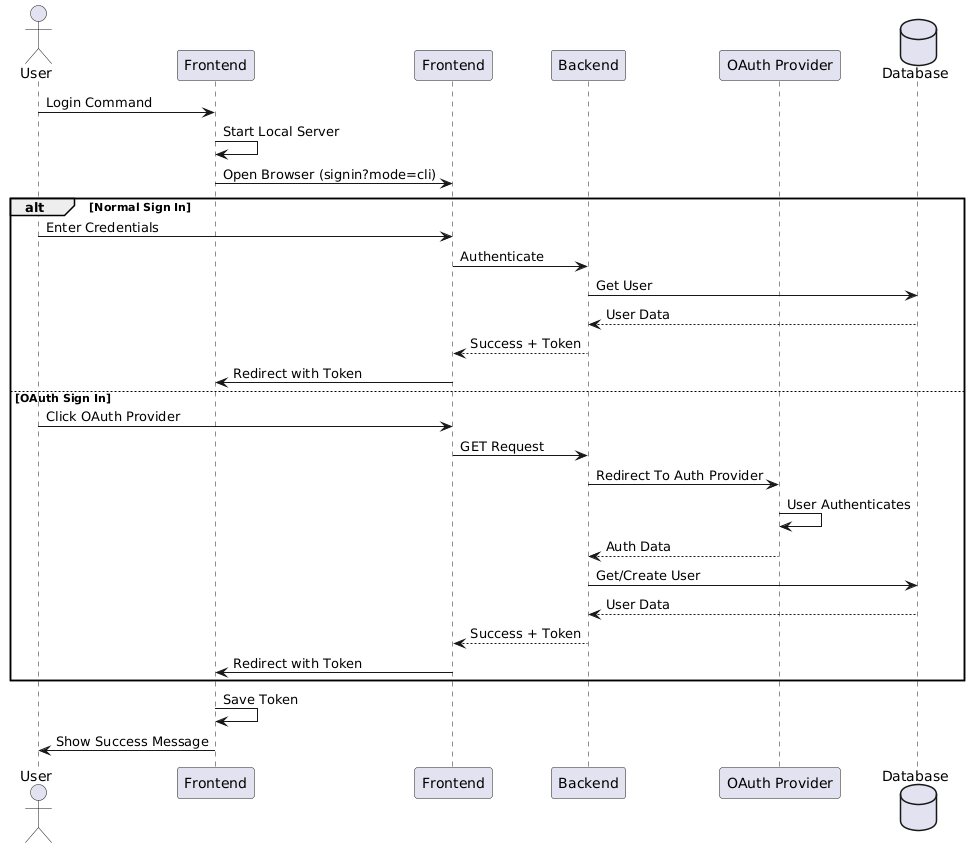

When the user initiates the login command, a local server is started and the user is directed to the sign-in page of the web application. indicating that the login is for CLI use. If the user signs in normally by entering credentials on the web interface, the frontend sends these credentials to the backend, which returns a JWT token. The token is then stored as a query to the local server. The server can then get this token and save it locally. Alternatively, if the user signs in using OAuth, the flow follows the OAuth process described earlier, however the JWT is stored as a query to the local server, which can then be retrieved and saved locally.

---

### 3.2.8 CLI Sync

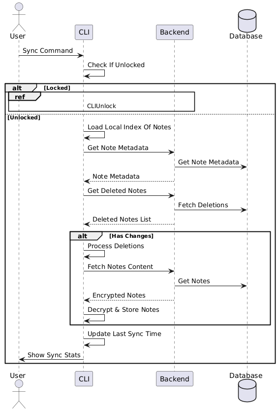

This diagrams describes how the CLI synchronises notes with the backend. When the user  runs the sync command, the CLI first checks whether the session is unlocked. IF it is locked, it triggers the CLI unlock flow. ONce unlocked, the CLI loads its local index of notes and sends a request to the backend to fetch note metadata and deleted notes since the last sync time. After the backend returns the response, the CLI updates its local index of notes processes deletions. If changes detected in notes since the last sync time, the CLI request the full content of the updated note. The backend returns the encrypted note, which the CLI decrypts and stores locally. The CLI, then updates its last sync timestamp.

---

### 3.2.9 Create Note

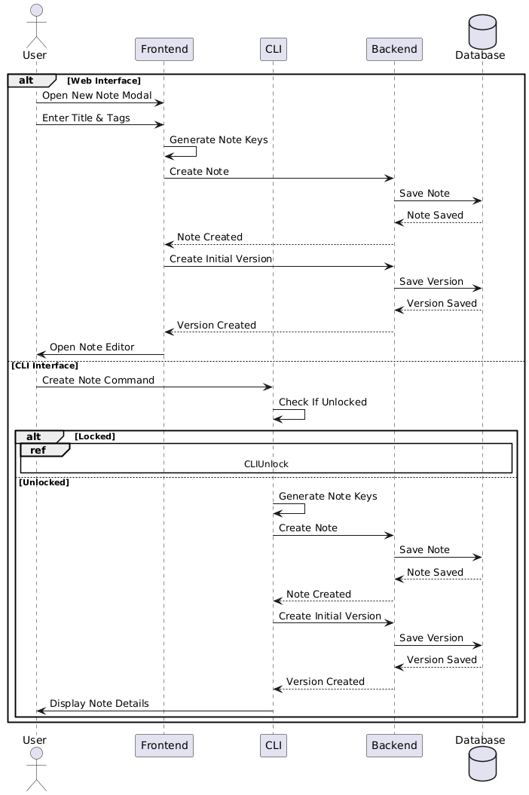

This diagram presents the flow for creating a new note, both via the web and CLI. In the web, the user opens a modal to create a note  by entering the title and tag. The frontend generates encryption keys for the note and sends a request to the backed to create a new note with the encrypted content, title, tags and necessary encryption data. Upon successful creation, an initial version of hte note is also created, and the note editor is opened for further modifications. In the CLI flow, the user enters the create note command. The CLI checks whether the sessions is unlocked, generates the note's encryptions keys and sends a request ot the backend to create a new note. After the backend creates the note, the initial version is also created. If the CLi is not unlocked, it triggers the CLI unlock flow.

---

### 3.2.10 Edit Note

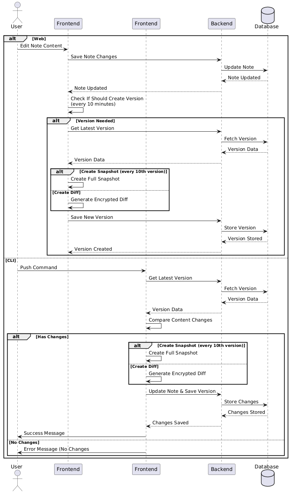

On the web, when a user edits a note, the encrypted modified data is sent to the backend to update the note in the database The frontend then determines whether a new version should be created. If so, the latest version is fetched, and the frontend generated either a fill snapshot or an encrypted diff. The new version is then stored in the database. The CLI process is similar, the user pushes changes through a command, and the CLI fetches the latest version from the backend. It compares local changes, and if differences are found, generates either a full snapshot or an encrypted diff. The encrypted updated note and new version are then stored in the database.

---

### 3.2.11 Web Restore Note

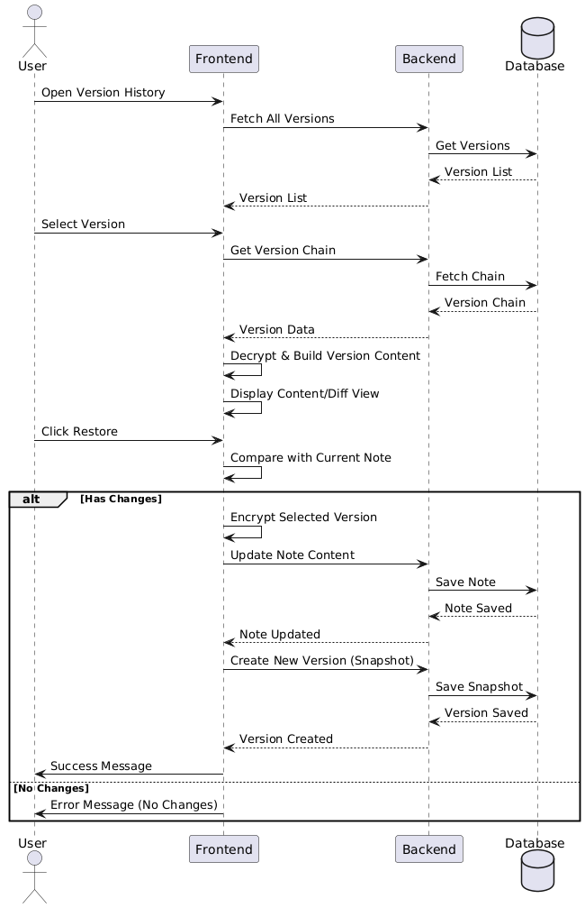

This diagram outlines the process for restoring a previous version of a note via the web. The user accesses the version history of a note, and the frontend sends a request to the backend to retrieve all versions from the database. When the user selects a specific version, the frontend request the full version chain (from the selected version back to the last snapshot). The frontend then decrypts the version chain and reconstructs the full note content and displays a preview to the user. When the user clicks on the restore button, it checks if differences exist, if so, the selected version is encrypted and sent to the backend to update the note. A new snapshot version is created to record the restoration.

---

### 3.2.12 CLI Restore Note

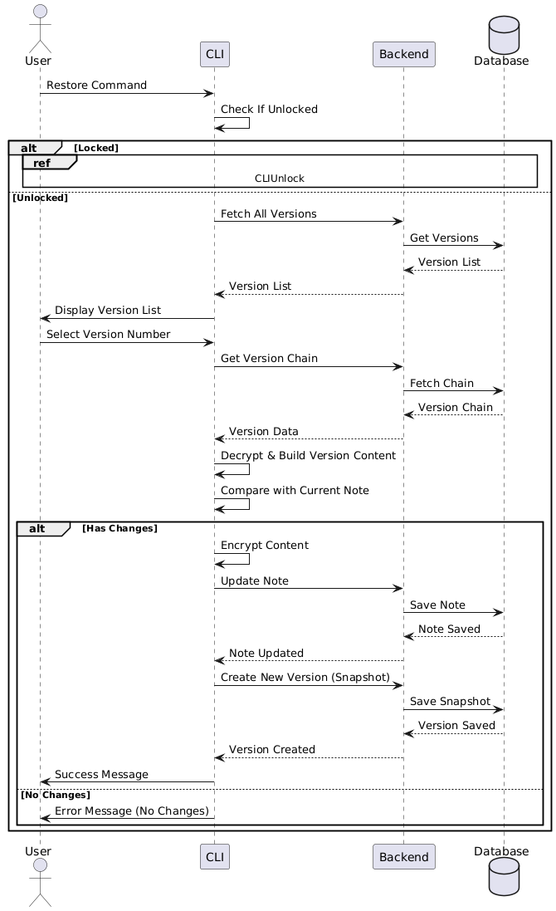


In the CLI, the enters the restore command, which first checks if the session is unlocked; if not, it triggers the CLI unlock flow. The CLI then request all available versions for the note from the backend and displays them for user selection. After the user selects a version, the CLI retrieves the version chain from the backend and decrypts it to reconstruct the full note content. The CLI compares the restored content with the current note, and if changes are detected, it encrypts the restored version and sends it to the backend to update the note. A new snapshot version is created to record the restoration.


# 4. Problems and Resolutions

## 4.1 Choosing the right encryption approach

### Problem

We needed to secure notes using encryption, but the decision was not straightforward. We thought about implementing asymmetric, symmetric or even hybrid approaches. Asymmetric encryption (like used in the Signal protocol) is well suited for message exchange between different users, but out use case was different. 

### Resolution

After evaluation various approaches and getting inspiration from systems like Bitwarden, we decided on a symmetric encryption approach. By basing the system on a master password that generates a key for both encryption and decryption, we could keep the design simple and secure. This approach got rid of unnecessary complexity and ensured only the user could access their notes.

## 4.2 Key Storage

## 4.2.1 CLI Key Storage

### Problem

Storing the symmetric key in memory on the CLI was complicated by how Go's Cobra framework spawns a new process for each command. This meant that any in-memory variables would not persist between commands. This was our initial approach as we tried to use the `Memguard` library to securely store the key in memory. Additionally, using hte OS's native key store wasn't an option for us in our WSL environment.

### Resolution

It took us a while to figure out how to solve this problem. In the end we decided to use a shell wrapper to store the key in an environment variable. Each command can access this environment variable, ensuring the key is available for the duration of the command. The wrapper also automatically checks if the variable is still set; if not; users must enter re-enter their master password. A benefit we got from using this method was that we could add a timeout mechanism so that the key only remains valid for a certain amount of time. It also handles our initial need of clearing the key on terminal close, as environment variables are cleared when a new terminal is opened.

## 4.2.2 Web Key Storage

### Problem

We had this same problem in the frontend, we needed a secure way to hold the symmetric key in the browser. Common storage methods like local storage and session storage weren't secure enough as they could be accessed by malicious scripts. We thought of other mechanisms but we found them to be too complicated to implement for our timeframe.

### Resolution

Under time constraints, we used a singleton in the global scope (via an IIFE) to hold the key in memory. The singleton remains in the same JavaScript content, so the key is only lost if the page is refreshed or closed. This approach isn't the most secure solution, but it was the best we could come up with at the time. 


## 4.3 Version Control

We wanted to store the note versions separately from the main note collection. Each version would only hold a "diff" rather than the entire note, which would reduce the amount of data stored and improve performance. Because we planned on doing client-side encryption, the server wouldn't be able to compute diffs itself.

### Problem

The problem we had was that we needed to be able to reconstruct the full content from only diffs, especially as the number of versions grows.


### Resolution

We resolved this by using a Snapshot + Diff approach similar to how Mpeg deals with video compression. The first version of a note would be a "snapshot", which contains the full note content. Subsequent edits generate "diff" versions. Every 10th version (and after restoring a note)  we store another snapshot to avoid reconstructing the content from a very long chain of diffs. 10 was chosen as we wanted to speed up development and testing.

## 4.4 Cross-Language Diff implementation and Delta Compression

### Problem

We needed to be able to compute diffs with diff logic compatible with both Go and JavaScript. We found the `diff-match-patch` library by Google that had an API to create diffs. Luckily there was a go implementation of the library, `go-diff` that we could use. The problem came from the fact that we decided to store the diffs as delta format which the `go-diff` library implemented. However this wasn't supported in the original API by Google.

### Resolution

In order to resolve this, we had to understand the `go-diff` library and how it implemented the delta format. After understanding the code, we added custom functions to `diff-match-patch`  to match the delta format. It was also important to ensure that Go and JavaScript consistently handled URL-encoded deltas so the data would remain valid across platforms.

## 4.5 Syncing Notes on CLI


### Problem

When we first created the sync endpoints, we only considered notes that were created or updated after the last sync time. We ignored the fact that the user might have deleted notes and these weren't being communicated to the CLI, causing local copies to remain when they should have been removed.

### Resolution

To solve this, we added a separate collection to track deleted Note IDs. Along with receiving updated or newly created notes, the CLI also gets a list of notes that were deleted. This approach was simpler than implementing a soft-delete system and required minimal changes to our codebase.

### Problem

Our initial sync logic iterated through the returned notes twice:

1. First pass: Identify which notes needed updated or created.
2. Second pass: Check if each note was new or an update to an existing one. This was done as notes were stored locally as well.
This resulted in an O(n<sup>2</sup>) complexity. For small numbers of notes, this was acceptable, but for large numbers, it would become a problem.

### Resolution

We fixed this by creating a local map of existing notes keyed by their IDs. When the response is received, each note is checked against the map to see if it already exists. If it does, it's an update, otherwise it's a new note. This reduced the complexity to O(n), significantly improving the performance of the sync operation.

## 4.6 Edit Note Modal closing on error

### Problem

When a user tried to edit a note's title or tag, the modal would close immediately after the request was sent. The expected behaviour was for the modal to remain open on error and show an error message, but it was closing prematurely.

### Resolution

Initially, we tried replicated the problem by adding a test button in another part of the app. In that context, the modal stayed open on error, which confused us. After a long time debugging, we discovered that sending the note update to the backend triggered a re-render of the note card on the homepage, causing the modal to lose its state about whether the edit modal should remain open. once we identified the issue, the fix was very simple, and this time the modal stayed open when the server returned an error.

## 4.7 Editor Performance issues

### Problem
We were using a single debounced function to both save the editor's content and update the live preview. Debouncing, a technique that delays function calls until a certain amount of time has passed, is meant to reduce constant updates. However, because the editor and preview shared the exact same content source, this setup introduced subtle bugs and caused the editor to lag.

### Resolution

We replaced the single debounced function with two separate debounced functions, one for saving the editor's content and one for updating the live preview. This solved the issue and the editor ran smoothly.

## 4.8 CLI login

### Problem

Another design issue we came across while implementing the system was the login process for the CLI. We didn't want to limit CLI users to only be able to use their email and password to login, we also wanted them to be able to login using Google or GitHub. Initially, we thought that this was going to be a difficult task, but after recalling our CA298 Fullstack module, we realised that solving this problem would be a lot easier than we thought.

### Resolution

To fix this, we added a flow that directs the user from the CLI to the web application with a query containing `mode=cli&redirect=http://localhost:2005`. Once the user arrives, the CLI sets up a local HTTP server on port 2005 to listen for the authentication callback. After the user enters their credentials on the web frontend, the same query is sent to the backend, which checks if the request came from the CLI. If so, it returns a JWT token as part of the URL back to the local HTTP server. Finally, the frontend redirects to that URL, allowing the CLI to capture the JWT token for user authentication.

## 4.9 Learning new things

We came across several new technologies during the development of the project, including, Go, Playwright, Cobra, CI/CD with GitLab and more. These were all new to use and we had to spend a lot of time learning how to use them effectively. This challenge was overcome by spending time researching and practising with these tools and languages. 

We read documentation and watched tutorial videos, and then began to experiment with them in our code. By also working together as a team, we were able to learn these new tools and languages together and we were able to help each other out when we got stuck. Online resources such as forum posts were key for any questions or errors we faced along the way.

In the end, we were able to become quite adept in these technologies and languages, and we feel that putting ourselves through the challenge of learning new technologies made us better developers.


## 4.10 Gitlab CI/CD Issues

We used GitLab's platform to develop and test our application. As this was our first time setting up a CI/CD pipeline, we encountered a few issues. However, these were easily resolvable as it was quite well documented. However some features weren't quite as documented.

Due to some issues of not being able to connect to the Mongo database from the College's default runner. Ali deployed a runner on his own machine. This helped solve the issue and also gave us valuable experience with self-hosting runners.

### Problem

We used "child pipelines" in our pipeline definition to separate concerns out between the frontend. backend and the CLI. This worked great for the most part, but came back to bite us when we needed to display testing and coverage information on merge requests, we rain into a bug with [how Gitlab handles artifacts from children](https://gitlab.com/gitlab-org/gitlab/-/issues/280818).

### Resolution


An option we had to solve it was by making the report artifacts of the child pipelines and pull the information back down in a later stage. This didn't seem like a great option, adding extra steps to the testing report. In the end we solved it by creating a keyed cache that would be mounted onto the self hosted runner.  This allowed us to add the test information from the child, then once the child had completed, we could access the information in the parent pipeline and display it as normal on the merge request.


## 4.11 Testing Issues

### Problem

Testing was a big part of our project and we had a few issues while implementing it. We tested out backend using integration tests using Node's built in testing framework. This worked well for the most part, However, the problem came when we began testing the frontend. We used Redux a lot in our application and it was difficult to test the application and the components as a whole. Tests were very difficult to write and we spent a lot fo time mocking the redux stores.

### Resolution

That was when we had the idea to check if the official Redux documentation had any suggestions on how to test the application. We found [this guide](https://redux.js.org/usage/writing-tests) which had a few good suggestions. They advised using the React testing library which we already were and defined a way to properly test ur components that relied on redux stores. After spending some time configuring it we managed to get it going and it made testing the components of the frontend very very easy compared to what we had before.


## Problem 

Another issue we came across while testing the frontend was that some components called the backend API to fetch data. This made it harder to fetch data and test the application as a whole. The backend also had this issue as we weren't able to properly test the Google and GitHub OAuth flows.

## Resolution

The solution, however, was quite simple. We just needed to mock the API calls. For the frontend, we used the MSW library which is a library that allows you to mock the API calls. For the backend, we used the `nock` library to mock the API calls. With the API interceptors in place, it wasn't long before we could get moving again.


# 5. Development Workflow

We adopted Jira as our issue tracking and project management tool to help us manage the development of the project. The reason as to why we didn't use GitLab's issue tracker was because we wanted to prepare ourselves for our internship as many companies use Jira for their project management. Also through its integration with GitLab, we were able to import and view Jira issues directly within Gitlab's issues board, ensuring a unified view of our backlog.

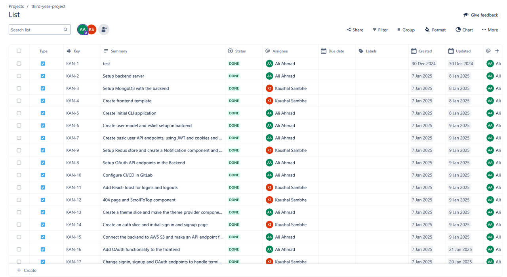

The image below is the imported Jira issues into GitLab's issue board.

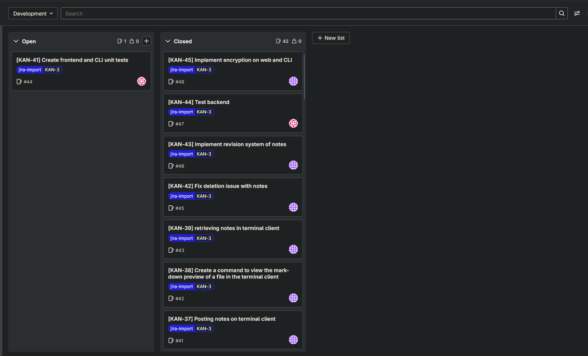

Our process was straightforward, when a bug emerged or a new feature was planned, we created an issue in Jira and organised these tasks on our KANBAN board. Each issue was clearly described whether it was a bug fix, new feature or test that needed to be done. 

When starting work on an issue, the a new branch was created from the main branch. The branch name reflected the issue number, making it easy to tie commits back to the original issue. Thanks to GitLab's integration, once a merge request was ready to be merged into the main branch, you could automatically close the issue in Jira by adding key words like "Closes KAN-12" into the commit message. 

This workflow not only helped us manage bugs and feature efficiently, but also allowed us to prepare for our internships by familiarising ourselves with industry-standard practices. 

# 6. Testing

## 6.1 GitLab CI/CD 

From the very beginning we intended to use GitLab's CI/CD to prevent regressions in our code, report metrics, test the application and have a user-friendly interface to find any issues and fix them.

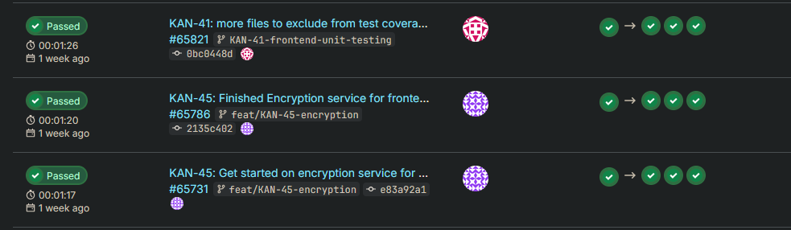

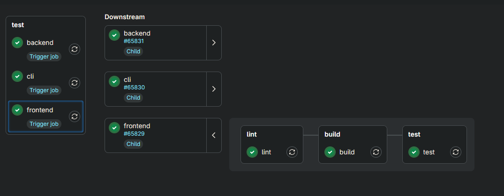

Each aspect of the application had its own pipeline, and we used child pipelines separate concerns. Each aspect had different stages created in the YAML file. Lint stage checks the code for linting issues to make sure it follows the appropriate Go and JavaScript style guidelines, while  the test stage tests the code with unit and integration tests. By making use of GitLab features like Test Cases, and pipelines running on merge requests we ensured that any software regressions from different branches being merged could be spotted and fixed early on.


We'll dive into some of the pipelines and jobs in more detail below.

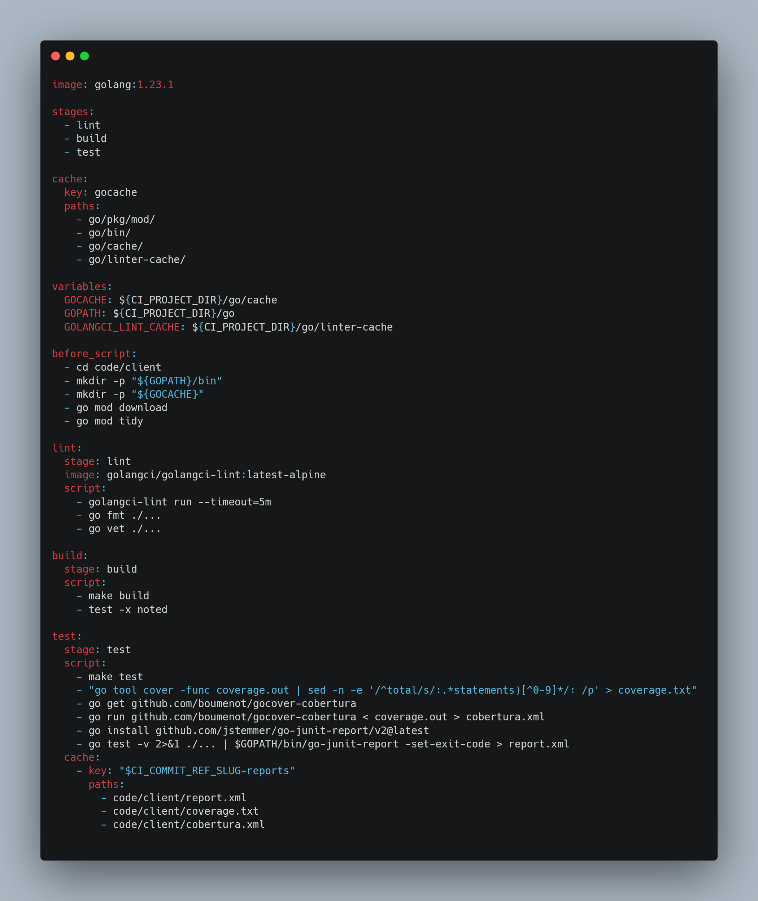

This is the pipeline for the terminal CLI. In every pipeline, we define the cache. This allows future stages to perform their tasks quicker because they can rely on built caches and artefacts from previous stages of the job.  In this case we cache Go's package directories to save time on redownloading packages. Similarly, in the frontend and backend pipelines we cache the node_modules directory to save time on redownloading the dependencies.

Next we perform the linting stage. the lint stage uses the `golangci-lint` tool to check the code for linting issues. This is a very useful tool that checks the code for issues and makes sure it follows the Go style guidelines. The build stage is where we compile the code which would output errors if the code could not be compiled. The test stages preforms the tests and outputs the result into a report. It generates  a coverage percentage of the CLI's code, a coverage `report.xml` and a coverage `cobertura.xml` file. These files are parsed by GitLab and are used to show code coverage and test reports on merge requests. We do the same for the frontend and backend pipelines. These are stored in a keyed cache for use by the parent pipeline. See more [here](#410-gitlab-cicd-issues).


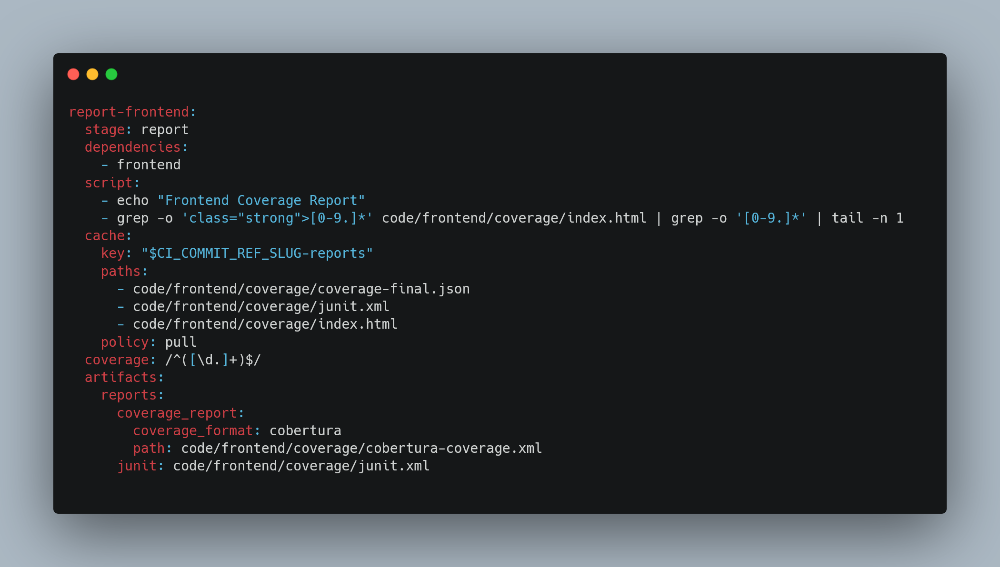

This `report-frontend` stage grabs the reports generated by the frontend pipeline and provides them to GitLab.. This allows coverage and tests to be shown on the merge request.  It also allows test coverage to appear in the merge request diff. 


# ADD COVERAGE BADGES FOR ALL THREE and merge request coverage

The coverage percentage for all three aspects can also be seen as a badge on the project's repository page.

## 6.1.1 Git Usage

Common Git practices were implemented to ensure both developers followed hte correct procedures when committing changes to the repository. The main branch is set as a protected branch to avoid pushing changes directly to the main branch without first testing the code. We created separate branched for different tasks, whether they're feature, bug fixes or test branches, or other JIRA-related to-dos as organised on our KANBAN board. Merge requests are created once a branch is ready to be merged into the main branch. The branch must be tested and checked in the CI pipeline before it can be merged and failure to do so will result in the merge request being blocked until the CI pipeline has run successfully.


## 6.2 Unit/Integration testing

## 6.2.1 Frontend

`Vitest` and `React Testing Library` were used to create unit tests for the `React` components and pages within the frontend. React Testing Library is designed to work with React components and focuses on testing how the application behaves rather than the implementation details.

With Vitest, we were able to test each individual component ensuring they worked correctly in isolation as well as with other components. This allowed us to catch bugs early on and improved the overall quality of the code. It allowed us to simulate user interactions and verify the behaviour of our components. 

Vitest offered a rich set of testing capabilities, such as mocking dependencies and simulating asynchronous operations. This was crucial for testing some of the components such as the editor and components that relied on API calls. As well as using Vitest to mock API async calls, we also used the MSW library to intercept the API calls and return mock data. THis allowed us to create reliable tests for our components.

By testing early on, we gained confidence in the reliability of our application and helped us catch and fix bugs early on.


## 6.2.2 Backend

For testing the backend we wrote  integration tests that tested each of the endpoints and the controllers functionality. We used Node's built in testing framework to check if the API is returning the correct status code and response when a request is sent. We also used the `nock` library to properly test the Google and GitHub OAuth flows. 

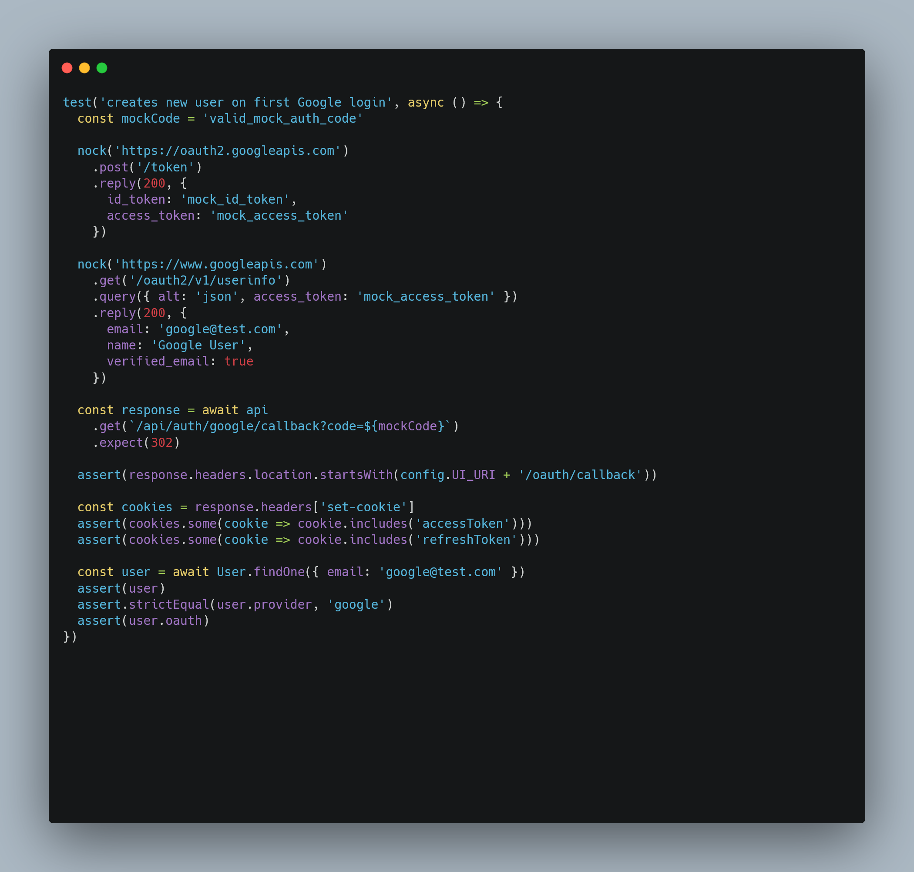

We also tested the other endpoints of our backend as well, such as note, version, image upload and encryption endpoints. The backend was heavily tested as it was a critical part of our application that both the frontend and CLI relied on. We were able to achieve 95% test coverage for the backend.

Examining and testing the responses of all actions was a great way to validate that operations performed exactly as they are expected to. Ensuring that expected responses alight with actual responses, the validity of the Express server was ensured.

## 6.2.3 CLI

For testing the CLI we wrote our tests using Go's built in testing package and used the `Testify` package to help write assertions. We were able to test CLI's functionality and ensure that it behaved as expected. However, due to time constraints, we couldn't test the CLI as thoroughly as we did the frontend and backend. We were however able to mock the API calls and test key functionality of the CLI that were critical to the application.

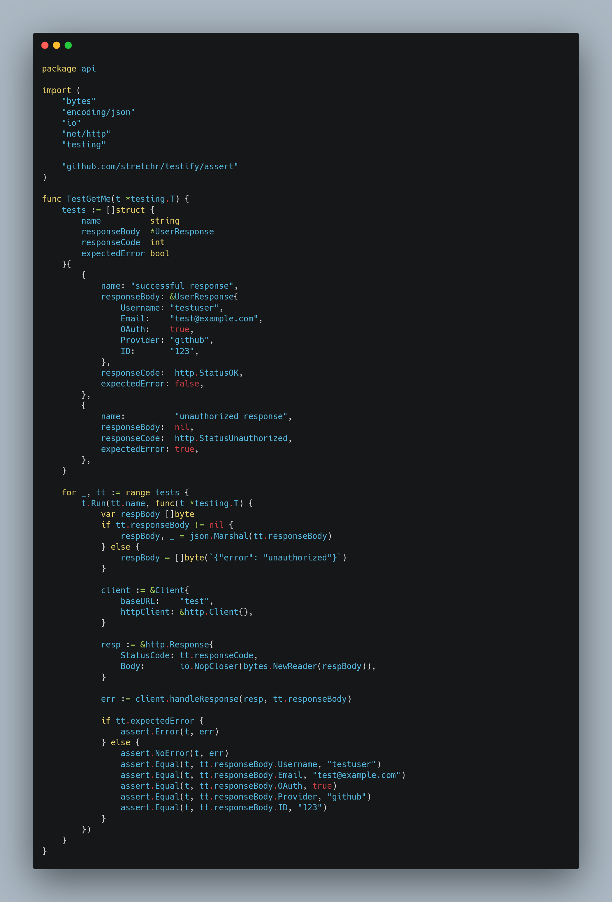


## 6.3 End-to-End testing

To ensure the overall functionality of our system, we used Playwright to create end-to-end tests. These tests were used to test the overall functionality of the system and to ensure that the application was working as expected. Playwright was very eay to setup and configure, ad provided a platform for simulating user interactions and verifying the behaviour of our application.

With Playwright we were able to write test cases for critical user flows and functionalities. These tests involved simulating user interactions, such as clicking buttons, entering data into forms and the editor and navigation between different pages. Playwright provided a user-friendly interface for visually inspecting the application's state during test execution. This made it much easier to debug and troubleshoot any issues that arose. 

By performing these tests, we were able to catch and address any issues that arose with our application. We gained confidence in the reliability of our application across different browsers. It allowed us to ensure that all components and APIs integrated correctly and that the system executes as expected, guaranteeing users that their notes will remain secure through our end-to-end encryption.


While running system tests, you will see the nice UI that Playwright provides for visually inspecting the application's state during test execution.
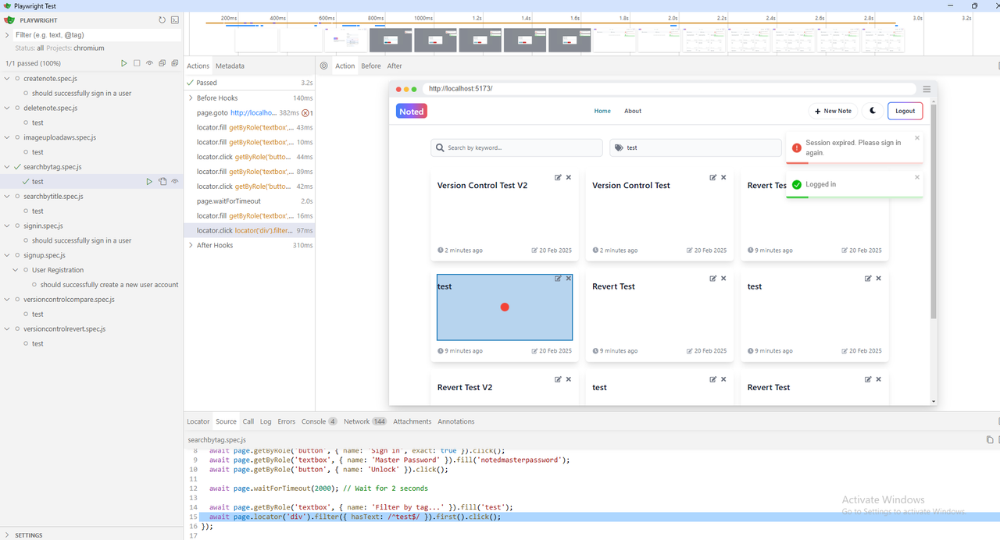

Playwright also provides a timeline for each test, allowing you to go back and forth between the different states of the application. Making it very easy to debug and troubleshoot any issues that arise.


As well as that, Playwright also provides a HTML report for each test, allowing you to see the different states of the application during test execution.

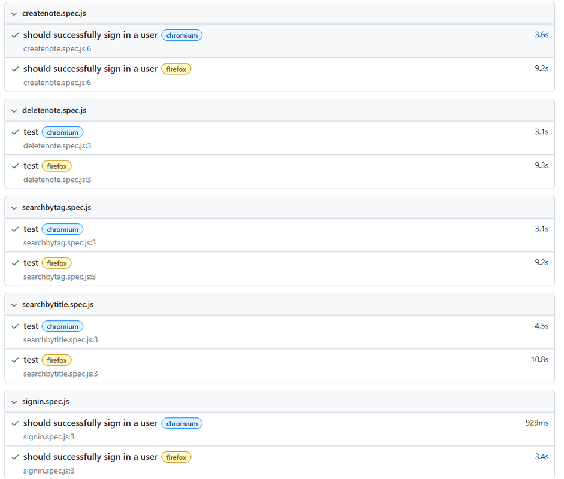

## 6.4 User testing

AS part of our testing strategy we decided to have some users test our system. We invited a group of 6 DCU students to individually test our system and provide us with feedback. Having users test our system was a good learning experience. When building the app there are certain features that you know behave a certain way so you interact with them in a certain way that would give an accurate behaviour. However, when you get users to test it, they don't know that and will interact with the app in a way that is not the same as what you expect. After the testing, a survey was distributed to all participants to fill, which asked questions regarding the features of our project. The results are shown below:

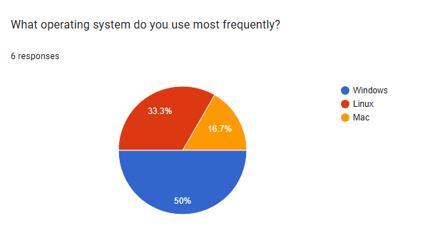


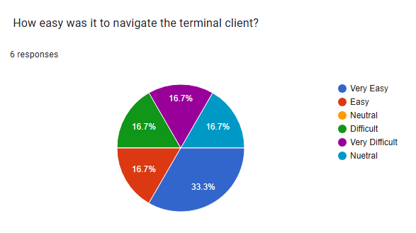

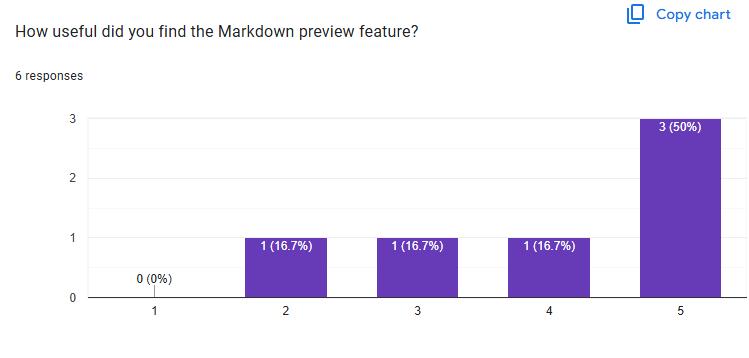

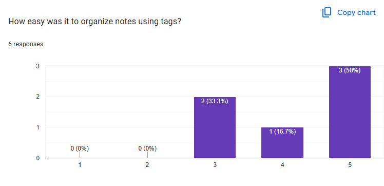

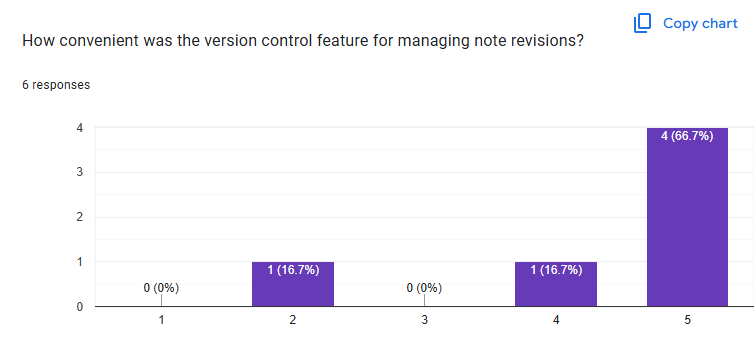

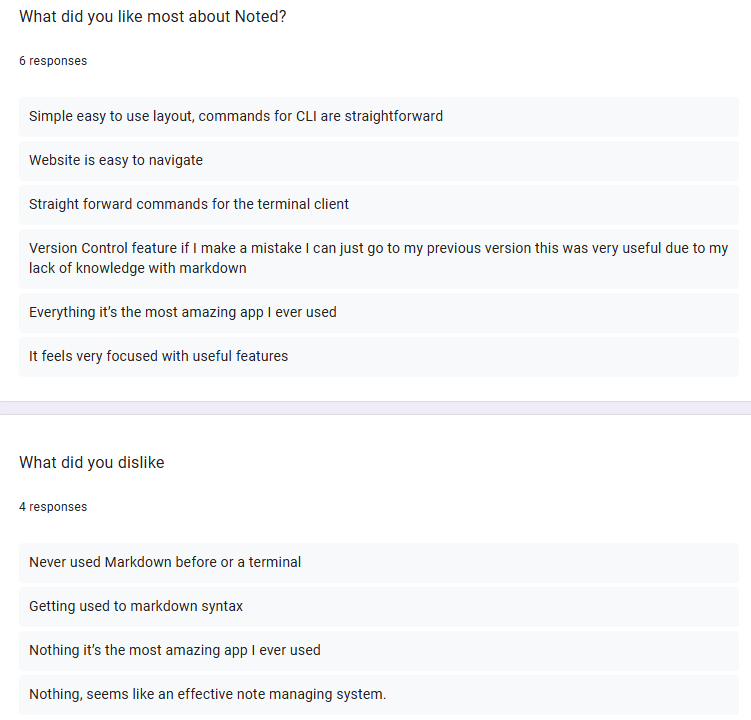

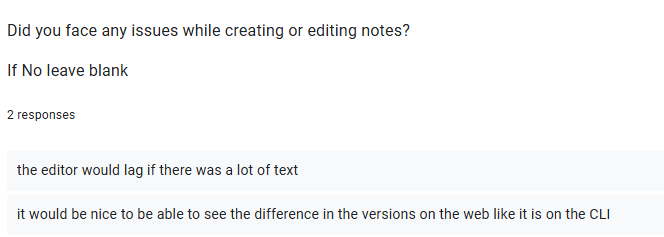


While the users were satisfied with the product, they provided us with valuable feedback. This feedback was taking into consideration and the suggested features were implemented.


# 7. Installation

## 7.1 Prerequisites


Software requirements:
- `Node.js` (v22.13.0)
- `npm` (v11.1.0)
- `Go` (v1.23.1)
- `Git`

Noted can only be installed on a Unix-based system.

To install Node.js and npm, run the following commands:

```bash
curl -o- https://raw.githubusercontent.com/nvm-sh/nvm/v0.40.1/install.sh | bash
```

```bash
nvm install 22.13.0
```

```bash
npm install -g npm@11.1.0
```

To install Go, run the following command:

```bash
wget https://go.dev/dl/go1.23.1.linux-amd64.tar.gz
```

```bash
tar -C /usr/local -xzf go1.23.1.linux-amd64.tar.gz
```

```bash
export PATH=/usr/local/go/bin:$PATH
```


After having the prerequisites installed, you can install the project source code from GitLab.
We will begin by cloning our Git repository.

```bash
git clone https://gitlab.computing.dcu.ie/ahmada5/2025-csc1049-ahmada5-noted.git
```

## 7.2 Backend Installation

1. Navigate to the backend directory.

```bash
cd 2025-csc1049-ahmada5-noted/code/backend
```

2. Install the required packages and dependencies for the Express server.

```bash
npm install
```

3. In addition to the dependencies, there are a few environment variables that need to be set in order for Noted to function. Create a `.env` file in the backend directory and add the following variables:

```bash
PORT=3000
MONGODB_URI=your_mongodb_uri
TEST_MONGODB_URI=your_test_mongodb_uri
SERVER_URI=http://localhost:3000
UI_URI=http://localhost:5173
ACCESS_SECRET=your_access_secret
REFRESH_SECRET=your_refresh_secret
GOOGLE_CLIENT_ID=your_google_client_id
GOOGLE_CLIENT_SECRET=your_google_client_secret
GOOGLE_REDIRECT_URI=http://localhost:3000/api/auth/google/callback
GITHUB_CLIENT_ID=your_github_client_id
GITHUB_CLIENT_SECRET=your_github_client_secret
GITHUB_REDIRECT_URI=http://localhost:3000/api/auth/github/callback
AWS_BUCKET_NAME=your_aws_bucket_name
AWS_BUCKET_REGION=your_aws_region
AWS_ACCESS_KEY_ID=your_aws_access_key_id
AWS_SECRET_KEY=your_aws_secret_key
EMAIL_USER=your_gmail_address
EMAIL_PASS=your_gmail_app_password
```

4. Once everything is configured, start the backend server.

```bash
npm start
```

## 7.3 Frontend Installation

1. Navigate to the frontend directory.

```bash
cd 2025-csc1049-ahmada5-noted/code/frontend
```

2. Install the required packages and dependencies for React

```bash
npm install
```

3. Once everything is configured, start the frontend server.

```bash
npm run dev
```


## 7.4 CLI Installation

1. Navigate to the CLI directory.

```bash
cd 2025-csc1049-ahmada5-noted/code/client
```

2. Install the required packages and dependencies for the CLI.

```bash
go mod download
```

3. Once everything is configured, start the CLI.

```bash
make install
```

4. Once the CLI is installed, copy this line and paste it in your `~/.zshrc` or `~/.bashrc` file.

```bash
source ~/.noted/wrapper.sh
```

5. Once the wrapper is installed, restart your terminal.

```bash
source ~/.zshrc
```
or

```bash
source ~/.bashrc
```

6. Now you can use the CLI by typing `noted` in your terminal.

```bash
noted
```