# Noted User Manual

Student 1: **Ali Ahmad** - 22312403
Student 2: **Kaushal Sambhe** - 22388443

Supervisor: **Dr. Stephen Blott**


# Table of Contents
- [1. Installation](#1-installation)
  - [1.1 Prerequisites](#11-prerequisites)
  - [1.2 Backend Installation](#12-backend-installation)
  - [1.3 Frontend Installation](#13-frontend-installation)
  - [1.4 CLI Installation](#14-cli-installation)
- [2. User Guide](#2-user-guide)
  - [2.1 Web Application](#21-web-application)
    - [2.1.1 Login/Signup](#211-login-signup)
    - [2.1.2 Creating a Note](#212-creating-a-note)
    - [2.1.3 Editing a Note](#213-editing-a-note)
      - [2.1.3.1 Uploading an Image](#2131-uploading-an-image)
    - [2.1.4 Managing Notes](#214-managing-notes)
      - [2.1.4.1 Editing and Deleting Notes](#2141-editing-and-deleting-notes)
      - [2.1.4.2 Searching and Filtering Notes](#2142-searching-and-filtering-notes)
    - [2.1.5 Managing Versions](#215-managing-versions)
    - [2.1.6 Changing the Theme](#216-changing-the-theme)
    - [2.1.7 Logging out/Forgetting your password](#217-logging-out-forgetting-your-password)
  - [2.2 CLI](#22-cli)
    - [2.2.1 Login/Signup](#221-login-signup)
    - [2.2.2 Creating a Note](#222-creating-a-note)
    - [2.2.3 Editing a Note](#223-editing-a-note)
    - [2.2.4 Managing Notes](#224-managing-notes)
    - [2.2.5 Preview a Note](#225-preview-a-note)
    - [2.2.6 Change the preview theme](#226-change-the-preview-theme)
    - [2.2.7 Push a Note to the Server](#227-push-a-note-to-the-server)
    - [2.2.8 Synchronize Notes with the Server](#228-synchronize-notes-with-the-server)
    - [2.2.9 Upload an Image](#229-upload-an-image)
    - [2.2.10 List all Notes](#2210-list-all-notes)
    - [2.2.11 Get the tags of a Note](#2211-get-the-tags-of-a-note)
    - [2.2.12 Search for a Note](#2212-search-for-a-note)
    - [2.2.13 Synchronize Notes with the Server](#2213-synchronize-notes-with-the-server)
    - [2.2.14 Upload an Image](#2214-upload-an-image)
    - [2.2.15 Versions](#2215-versions)
      - [2.2.15.1 List Versions](#22151-list-versions)
      - [2.2.15.2 Compare Versions](#22152-compare-versions)
      - [2.2.15.3 Show a Version](#22153-show-a-version)
      - [2.2.15.4 Restore a Note to a Version](#22154-restore-a-note-to-a-version)
    - [2.2.16 Get Help](#2216-get-help)
    - [2.2.17 Completion](#2217-completion)
      - [2.2.17.1 Setting Up in Bash](#22171-setting-up-in-bash)
      - [2.2.17.2 Setting Up in Zsh](#22172-setting-up-in-zsh)
      - [2.2.17.3 Setting Up in Fish](#22173-setting-up-in-fish)
      - [2.2.17.4 Setting Up in PowerShell](#22174-setting-up-in-powershell)
    - [2.2.19 Logging Out](#2219-logging-out)
    - [2.2.20 Get Current User](#2220-get-current-user)


# 1. Installation

## 1.1 Prerequisites

Make sure to have the following installed on your machine:
- `Node.js` (v22.13.0)
- `npm` (v11.1.0)
- `Go` (v1.23.1)

After having the prerequisites installed, you can install the project source code from GitLab.
We will begin by cloning our Git repository.

```bash
git clone https://gitlab.computing.dcu.ie/ahmada5/2025-csc1049-ahmada5-noted.git
```

## 1.2 Backend Installation

1. Navigate to the backend directory.

```bash
cd 2025-csc1049-ahmada5-noted/code/backend
```

2. Install the required packages and dependencies for the Express server.

```bash
npm install
```

3. In addition to the dependencies, there are a few environment variables that need to be set in order for Noted to function. Create a `.env` file in the backend directory and add the following variables:

```bash
PORT=3000
MONGODB_URI=your_mongodb_uri
TEST_MONGODB_URI=your_test_mongodb_uri
SERVER_URI=http://localhost:3000
UI_URI=http://localhost:5173
ACCESS_SECRET=your_access_secret
REFRESH_SECRET=your_refresh_secret
GOOGLE_CLIENT_ID=your_google_client_id
GOOGLE_CLIENT_SECRET=your_google_client_secret
GOOGLE_REDIRECT_URI=http://localhost:3000/api/auth/google/callback
GITHUB_CLIENT_ID=your_github_client_id
GITHUB_CLIENT_SECRET=your_github_client_secret
GITHUB_REDIRECT_URI=http://localhost:3000/api/auth/github/callback
AWS_BUCKET_NAME=your_aws_bucket_name
AWS_BUCKET_REGION=your_aws_region
AWS_ACCESS_KEY_ID=your_aws_access_key_id
AWS_SECRET_KEY=your_aws_secret_key
EMAIL_USER=your_gmail_address
EMAIL_PASS=your_gmail_app_password
```

4. Once everything is configured, start the backend server.

```bash
npm start
```

## 1.3 Frontend Installation

1. Navigate to the frontend directory.

```bash
cd 2025-csc1049-ahmada5-noted/code/frontend
```

2. Install the required packages and dependencies for React

```bash
npm install
```

3. Once everything is configured, start the frontend server.

```bash
npm run dev
```


## 1.4 CLI Installation

1. Navigate to the CLI directory.

```bash
cd 2025-csc1049-ahmada5-noted/code/client
```

2. Install the required packages and dependencies for the CLI.

```bash
go mod download
```

3. Once everything is configured, start the CLI.

```bash
make install
```

4. Once the CLI is installed, copy this line and paste it in your `~/.zshrc` or `~/.bashrc` file.

```bash
source ~/.noted/wrapper.sh
```

5. Once the wrapper is installed, restart your terminal.

```bash
source ~/.zshrc
```
or

```bash
source ~/.bashrc
```

6. Now you can use the CLI by typing `noted` in your terminal.

```bash
noted
```

# 2. User Guide

## 2.1 Web Application

## 2.1.1 Login/Signup


Once you first visit the web page, you will be redirected to the login page if you are not already logged in. You can either sign in to an existing account or create a new one. You have three options for signing in: You can either use your email address and password, or sign in via Google or GitHub.

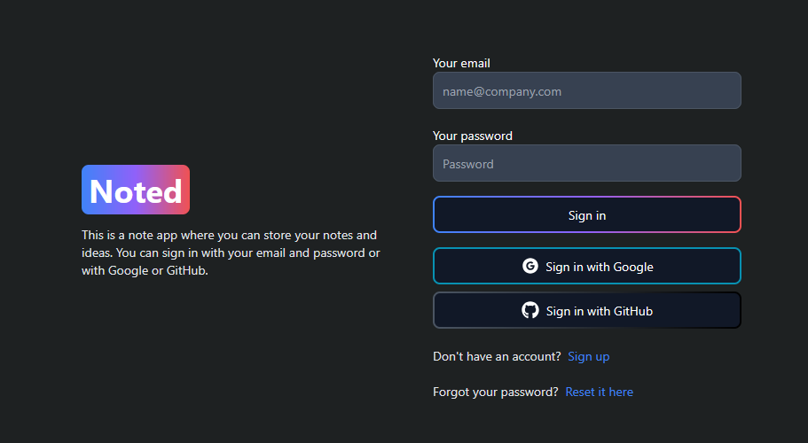

If you are a new user, you can create an account by clicking on the "Sign up" link. If you already have an account, enter your login credentials. Once you have created your account, you will be prompted to create your master password. This is used to encrypt the contents of your notes and ensure that only you can access them. Noted operates with zero-knowledge encryption. This means that Noted has zero knowledge of a way to retrieve or reset your master password. You are in charge of remembering your master password.

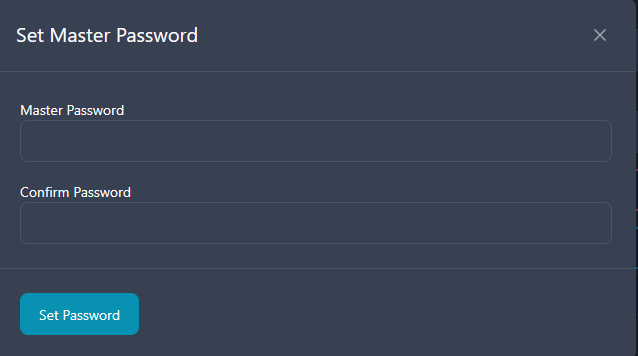

Once you have created your master password, you will be redirected to the home page.

If you already have an account, and signed in, you will be redirected to the home page where you will be asked to enter your master password.

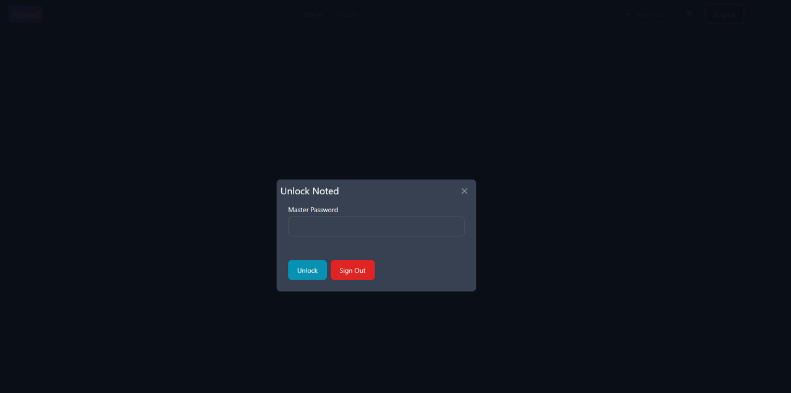

After successfully entering your master password, you will be be able to view the home page.

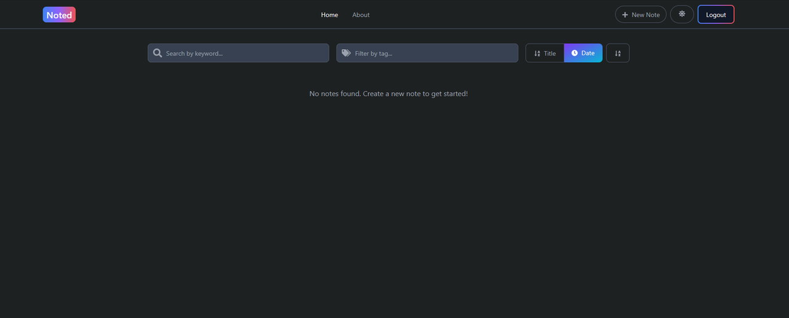

## 2.1.2 Creating a Note

To get started with creating a note, you can click on the "New Note" button in the top right corner of the screen. You will then be prompted to enter a title or tags (optional) for your note. After the note is created you will be redirected to the edit note page.

## 2.1.3 Editing a Note

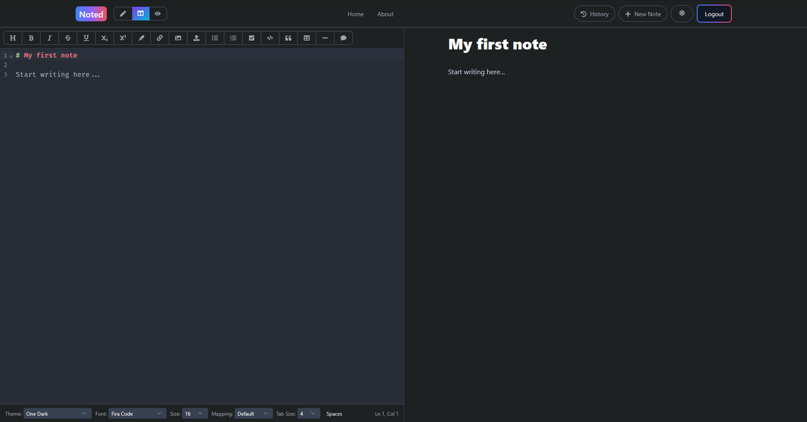

This is where you will be able to edit your note using Markdown. If you are new to Markdown, you can visit the "about page" on the navigation bar to learn some of the basics and advanced features that Noted supports. As shown in the image above, there is a toolbar that allows you to format your text using Markdown for you. Some Markdown features that deal with formatting text such as bold and italic will wrap around any selected text. If no text is selected it will insert a sample bolded sentence at the current cursor position. Other features such as headings and lists will insert the appropriate Markdown syntax at the start of the line. As you write your Markdown note, you will be able to see a live preview of your note on the right hand side.

In the top left corner you will have the option to change the view of your note. You can choose just to choose the editor, the preview or both, which is the default option. The status bar is at the bottom of the editor. From here you can see your line and column number and have the option to change the theme, font style, and font size. You can also change the keyboard mapping. The available options are: Vim, Emacs, Sublime and the default option. Also available is the option to change the tab indent size and a toggle button to swap between indenting using tabs or spaces. Your configuration for your editor will be saved every time you make a change to it.

## 2.1.3.1 Uploading an Image

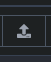

You can upload an image to your note by clicking on the "Upload Image" button in the toolbar. You will then be prompted to select an image to upload. Once you have selected an image, the URL for the image will then be inserted into where your cursor is in the editor.

## 2.1.4 Managing Notes

## 2.1.4.1 Editing and Deleting Notes

If you need to edit the title, tags or delete a note, you will be able to do so by going back to the home page.

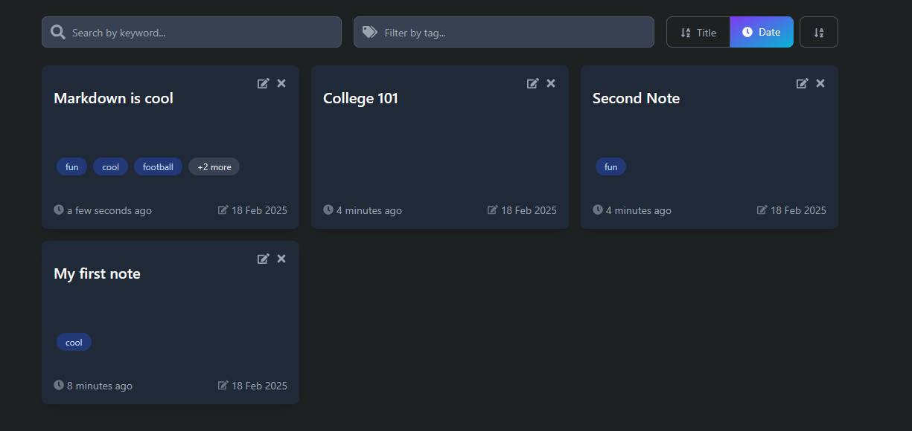

Each note has an edit and delete button at the top right corner. By clicking on the edit button you will be able to edit the title and tags, if any. By clicking on the delete button, you will be able to delete the note.

## 2.1.4.2 Searching and Filtering Notes

You can search for a note by typing in the title or tag in the search bar at the top of the home page. This will then filter the notes displayed based on your search query. You can also sort the notes by updated date or by title and furthermore you can sort resulting notes in ascending or descending order. By default the notes are sorted by updated date. 


## 2.1.5 Managing Versions

There are three ways in which a new version of your note is created. The first is when you create a new note. The second is when you change the title or tags of the note. And the third is when you edit the contents of the note in the editor. While editing, a new version is created every 10 minutes. In order to view the history of the note, simply click on the "History" button in the top right corner of the note. This "History" button will only be visible if you are on the editor page. After clicking on the button, a modal will appear showing the history of the note.

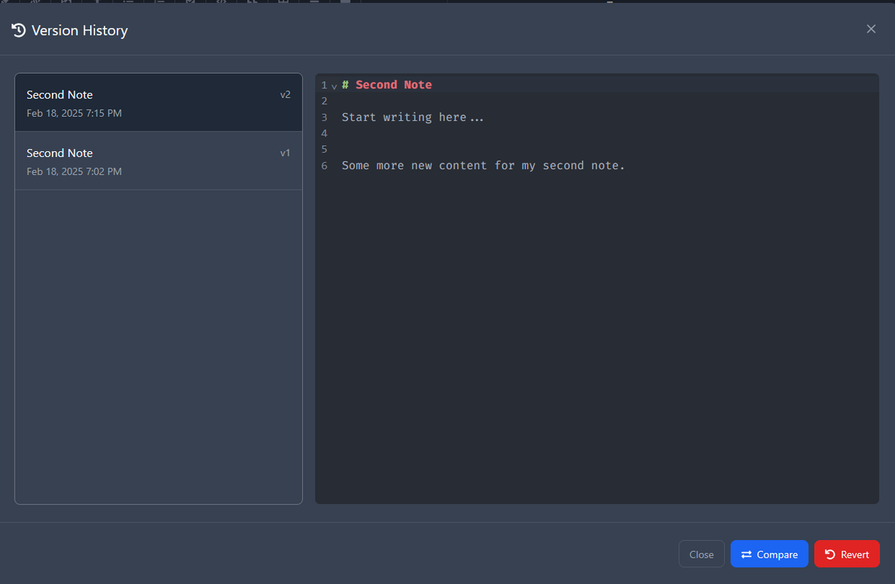

Here you will be to select different versions of your note. It will also display the Markdown content of the note in a read only display.

At the bottom of the modal, you will have the option to compare the selected version with the version before it.

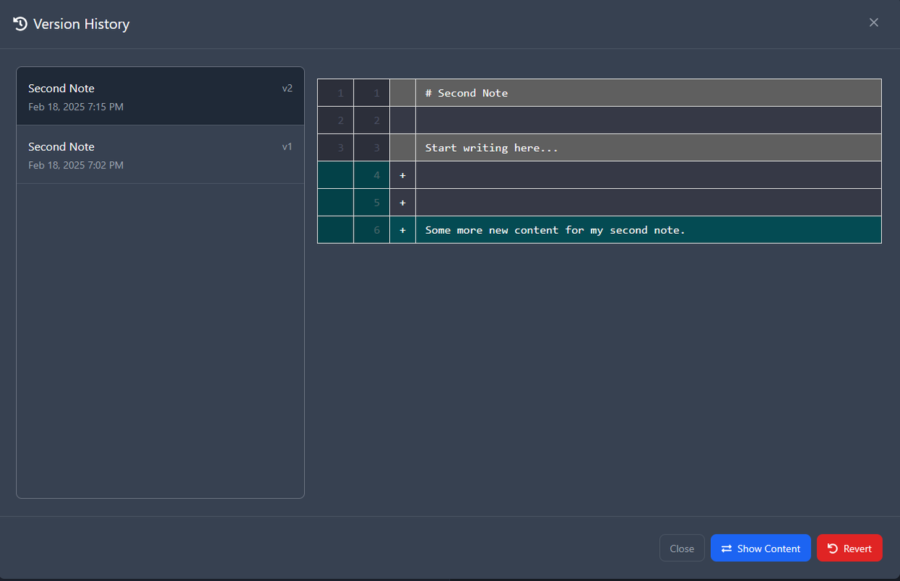

This will show you the changes that were made to the note between the two versions. Any new changes would be highlighted in green and any removed changes would be highlighted in red. Any content note changes would be highlighted in gray. To go back to the original display of the selected version, click the same button, now called "Show Content" again.

In order to restore your note to a selected versionhttps://i.postimg.cc/zDxn8T1M/image.png, click on the "Restore" button at the bottom right of the modal. This will restore your note to the selected version.

## 2.1.5 Changing the Theme

In order to change switch the theme between light and dark mode, you can click the sun or moon icon in the top right corner of the navigation bar.

## 2.1.6 Logging out/Forgetting your password

To logout of Noted, click on the "Logout" button in the top right corner of the navigation bar. This will be on the right side of the theme toggle button. After clicking on the button, you will be logged out and redirected to the login page.

If you forgot your password (the password for your account and not your master password), you can click on the "Reset it here" link in the login page.


This will redirect you to the forgot password page, where you will be asked to enter your email address. Once you have entered your email address, a notification will appear saying that a password reset email has been sent to your email address.

After opening your email inbox, you will see an email with a link to reset your password. You may need to check your spam folder. After clicking on the link, you will be redirected to the reset password page.

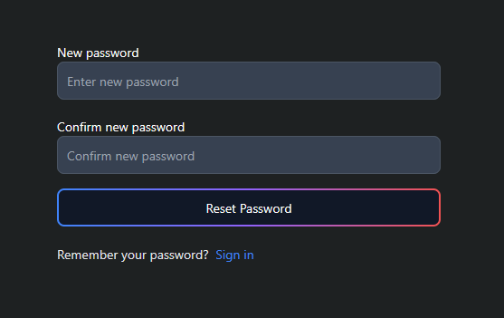

This will redirect you to the reset password page, where you will be asked to enter your new password. Once you have entered and confirmed your new password, you will be redirected to the login page.


## 2.2 CLI (For more advanced users)

To list all the commands available in the CLI, you can use the command `noted` or `noted --help`. Running this command will display the following:

```
Welcome to Noted!

Noted is a powerful Markdown note-taking application with advanced features, encryption and version control.

Usage:
  noted [command]

Available Commands:
  auth             Authentication commands
  completion       Generate the autocompletion script for the specified shell
  create           Create a new note, requires noted to be unlocked
  delete           Delete a note
  edit             Edit a note
  edit-data        Edit note metadata, requires noted to be unlocked
  help             Help about any command
  image            Image management commands
  list             List all notes
  preview          Preview a note with markdown formatting
  push             Push note changes to server, requires noted to be unlocked
  search           Search for notes by title or tag
  setup-encryption Setup encryption for your notes only if it is not already set up
  sync             Synchronize notes with the server, requires noted to be unlocked
  tags             Display tags for a note
  theme            Set or view the markdown rendering theme
  unlock           Unlock noted for a limited time (1 hour)
  version          Manage note versions, requires noted to be unlocked

Flags:
  -h, --help     help for noted
  -t, --toggle   Help message for toggle

Use "noted [command] --help" for more information about a command.
```

Noted stores all notes locally on your machine. However, versions for notes are stored on the server. 

The following commands require an active internet connection:
- `noted create`
- `noted delete`
- `noted edit-data`
- `noted push`
- `noted sync`
- `noted image`
- `noted setup-encryption`
- `noted unlock`
- `noted search`
- `noted auth login`
- `noted auth me`
- `noted version list`
- `noted version diff`
- `noted version show`
- `noted version restore`

The rest of the commands do not require an active internet connection.

## 2.2.1 Login/Signup

In order to login or signup using the CLI, you can use the command `noted auth login`.
This will redirect you to the login page of the web application. From here you can login to an existing account or create a new account. 

After you login or signup, you will be redirected to a different page that will confirm that you have successfully logged in or signed up. You can close this tab and return back to the CLI.

If for whatever reason you fail to enter your master password, you can use the command `noted setup-encryption`. This will prompt you to set your master password.

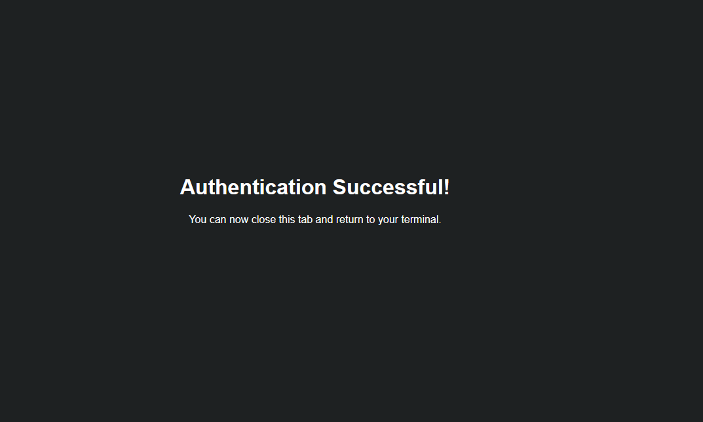

If you created an account, once you return back to CLI, you will be asked to enter and confirm your master password. As mentioned above, Noted operates with zero-knowledge encryption. This means that Noted has zero knowledge of a way to retrieve or reset your master password. You are in charge of remembering your master password.

## 2.2.2 Unlocking Noted on the CLI

Some commands on the CLI requires Noted to be unlocked. To unlock Noted, you can use the command `noted unlock`. This will prompt you to enter your master password. This will unlock Noted for a limited time (1 hour).

The commands that require Noted to be unlocked are:
- `noted create`
- `noted delete`
- `noted edit-data`
- `noted push`
- `noted sync`
- `noted version list`
- `noted version diff`
- `noted version show`
- `noted version restore`

By entering any of these commands if Noted is locked, you will be prompted to enter your master password.

## 2.2.3 Creating a Note

To create a new note, you can use the command `noted create`. This will command takes in a title and an optional tag flag. 

To create a note with the title "My Note" and the tag "Work", you can use the following command:

```bash
noted create --title "My Note" --tag "Work"
```
or using the shorthand flag

```bash
noted create -t "My Note" --tag "Work"
```


## 2.2.4 Editing a Note

To edit a note, you can use the command `noted edit`. This command accepts a note id as an argument or a title flag.

To edit the note with the title "My Note", you can use the following command:

```bash
noted edit -t "My Note"
```

or using id

```bash
noted edit 67b12d7739ef972bb7749f3e
```
This command will open the note in your default editor.

If you use the title flag for any command that accepts a title flag and you have multiple notes with the same title, you will be given a menu to select the note you want to edit. 
```
Multiple notes found with title "My Note":
[1] My Note 67b4f0948c06b8f8cafaefef  (created: 2025-02-18 20:41:56, updated: 2025-02-18 20:41:56)
[2] My Note 67b4f0928c06b8f8cafaefe8  (created: 2025-02-18 20:41:54, updated: 2025-02-18 20:41:54)
Choose a number:
```


## 2.2.5 Preview a Note

To preview a note, you can use the command `noted preview`. This command accepts a note id as an argument or a title flag.

```bash
noted preview -t "My Note"
```

This command will render your note in the terminal to give you a web like experience.

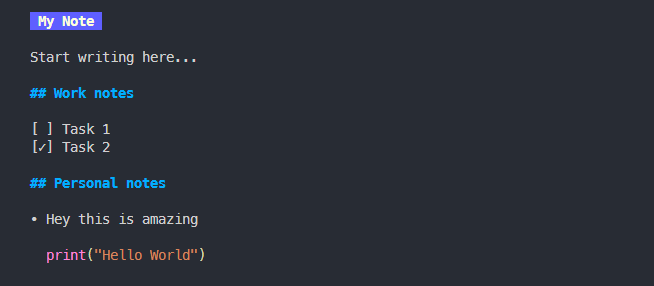

## 2.2.6 Change the preview theme

To change the preview theme, you can use the command `noted theme`. This command a theme as an argument.

The available themes are:
- `auto`
- `dark`
- `light`
- `ascii`
- `dracula`
- `tokyo-night`
- `notty`
- `pink`

To change the theme to "dark", you can use the following command:

```bash
noted theme dark
```

## 2.2.7 Push a Note to the Server

To push a note to the server, you can use the command `noted push`. This command accepts a note id as an argument or a title flag.

```bash
noted push -t "My Note"
```

## 2.2.8 Delete a Note

To delete a note, you can use the command `noted delete`. This command accepts a note id as an argument or a title flag.

```bash
noted delete -t "My Note"
```

## 2.2.9 Edit Note Title and Tags

To edit the title or tags of a note, you can use the command `noted edit-data`. This command accepts a note id as an argument or a title flag. It also accepts a new title flag, new tags flag and a replace flag.

```bash
noted edit-data --title "My Note" --new-title "New Title" --tags "New Tag" --replace
```
or using the shorthand flags

```bash
noted edit-data -t "My Note" -n "New Title" --tags "New Tag" -r
```

By having the replace flag set it will replace the existing tags with the new tags. If the replace flag is not set, the new tags will be added to the existing tags.

## 2.2.10 List all Notes

To list all notes, you can use the command `noted list`. This command will list all notes in the order of the most recently updated note.

```bash
noted list
```

## 2.2.11 Get the tags of a Note

To get the tags of a note, you can use the command `noted tags`. This command accepts a note id as an argument or a title flag.

```bash
noted tags -t "My Note"
```

## 2.2.12 Search for a Note

To search for a note, you can use the command `noted search`. This command accepts a title or tag flag.

```bash
noted search -t "My Note" --tag "Work"
```

This command will display all notes with the title "My Note" and the tag "Work".


## 2.2.13 Synchronize Notes with the Server

In the case where you have edited a note on the web application and you want to synchronize the changes to the local machine, you can use the command `noted sync`.

```bash
noted sync
```

This command will get any notes that were created or edited on the web application and update the local machine with the latest version. It will also remove any notes that were deleted on the web application.

It also takes an optional verbose flag to show more details on what was created, edited or deleted.

```bash
noted sync --verbose
```

## 2.2.14 Upload an Image

To upload an image to a note, you can use the command `noted upload image`. This takes in as an argument the file path of the image you want to upload.

```bash
noted upload image /path/to/image.png
```
The command will upload the image to the server and return the URL of the image for you to use in your note.

If you want to copy the image straight to your clipboard, you can use the `--copy` flag.

```bash
noted upload image /path/to/image.png --copy 
```

## 2.2.15 Versions

## 2.2.15.1 List Versions

To list the versions of a note, you can use the command `noted version list`. This command accepts a note id as an argument or a title flag.

```bash
noted version list -t "My Note"
```

This command will display all the versions of the note with the title "My Note".

## 2.2.15.2 Compare Versions

This command will compare the selected version with the version before it and prettily display the changes.

```bash
noted version diff -t "My Note"
```
This command will display all the available versions and will ask you to select a version to compare with the version before it.

```
Available versions:

Ver  Created               Title    Tags
-----------------------------------------
#1   2025-02-18 20:41:56   My Note  work
#2   2025-02-18 21:08:01   My Note  work

Choose a number (1-2):
```


## 2.2.15.3 Show a Version

To show a version, you can use the command `noted version show`. This command accepts a note id as an argument or a title flag.

```bash
noted version show -t "My Note"
```

A selection menu will be displayed to you to select the version you want to show.
This will then render the selected version in the terminal.

## 2.2.15.4 Restore a Note to a Version

To restore a note to a version, you can use the command `noted version restore`. This command accepts a note id as an argument or a title flag.

```bash
noted version restore -t "My Note"
```


## 2.2.16 Get Help

To get help for a command, you can use the command `noted help`. This command accepts a command as an argument.

```bash
noted help version
```

## 2.2.17 Completion

To generate the autocompletion script for your shell, you can use the command `noted completion`. This command accepts a shell as an argument.

The available shells are:
- `bash`
- `zsh`
- `fish`
- `powershell`

```bash
noted completion bash
```


## 2.2.17.1 Setting Up in Bash

1. **Generate the Script**  
   ```bash
   noted completion bash > noted-completion.bash
   ```
   This command saves the generated completion script to a file named `noted-completion.bash`.

2. **Move it to the Completion Directory**  
   - If you have system-wide permissions, copy it to `/etc/bash_completion.d/`:
     ```bash
     sudo mv noted-completion.bash /etc/bash_completion.d/
     ```
   - Otherwise, you can place it in your home directory and source it in your `~/.bashrc`:
     ```bash
     mv noted-completion.bash ~/.noted-completion.bash
     echo "source ~/.noted-completion.bash" >> ~/.bashrc
     ```

3. **Reload Your Shell**  
   Start a new session or run:
   ```bash
   source ~/.bashrc
   ```
   You should now have autocompletion for `noted` in Bash!


## 2.2.17.2 Setting Up in Zsh

1. **Generate the Script**  
   ```bash
   noted completion zsh > noted-completion.zsh
   ```

2. **Enable Completions (If Not Already Enabled)**  
   Make sure you have the following lines in your `~/.zshrc`:
   ```bash
   autoload -U compinit
   compinit
   ```

3. **Add the Generated Script**  
   - Option A: Copy it to a folder in your `$fpath`. For example the directory `/usr/local/share/zsh/site-functions/`
     ```bash
        sudo mv noted-completion.zsh /usr/local/share/zsh/site-functions/
     ```
   - Option B: Place it anywhere (e.g., `~/.zsh/`) and source it in `~/.zshrc`. For example:
     ```bash
     mkdir -p ~/.zsh
     mv noted-completion.zsh ~/.zsh/
     echo "source ~/.zsh/noted-completion.zsh" >> ~/.zshrc
     ```

4. **Reload Your Shell**  
   Either open a new terminal or run:
   ```bash
   source ~/.zshrc
   ```
   Autocompletion for `noted` should now work in Zsh.


## 2.2.17.3 Setting Up in Fish

1. **Generate the Script**  
   ```bash
   noted completion fish > noted-completion.fish
   ```

2. **Move It to Your Fish Completions Directory**  
   Usually, Fish completions live in `~/.config/fish/completions/`:
   ```bash
   mkdir -p ~/.config/fish/completions
   mv noted-completion.fish ~/.config/fish/completions/
   ```

3. **Reload Your Shell**  
   Open a new Fish session or just run:
   ```bash
   exec fish
   ```
   Now `noted` completions will be available in Fish!


## 2.2.17.4 Setting Up in PowerShell

Noted does not support Powershell, as this application was testing on a Linux machine.


## 2.2.19 Logging Out

To log out, you can use the command `noted auth logout`. This command will log you out of your current session.

```bash
noted auth logout
```

When you log out, your notes will not be deleted locally. They will be deleted if you choose to log back in with a different account. 

## 2.2.20 Get Current User

To get the current user, you can use the command `noted auth me`. This command will display the current user.

```bash
noted auth me
```